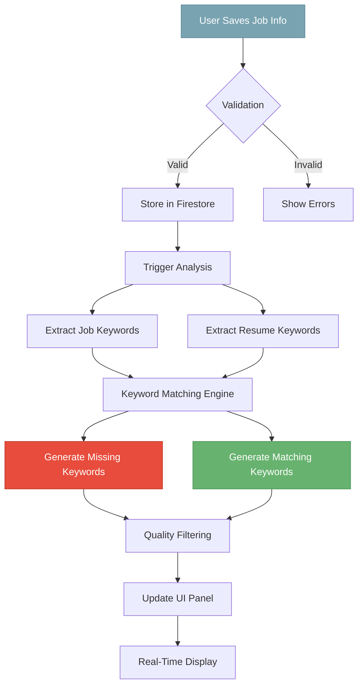

# Keyword Targeting Workflow
## Intelligent ATS Optimization Engine
### Real-Time Resume-to-Job Keyword Analysis System

---

## 🎯 Executive Overview

The Keyword Targeting Workflow represents a sophisticated Natural Language Processing (NLP) engine designed to maximize resume ATS (Applicant Tracking System) compatibility through intelligent keyword gap analysis. By analyzing the semantic relationship between job descriptions and resume content, the system identifies critical missing keywords that significantly impact ATS scoring, providing users with actionable insights to optimize their applications.

### Core Value Proposition
- 🔍 **Precision Keyword Extraction** - Identifies high-impact 1-3 word terms that matter most to ATS
- ⚡ **Real-Time Analysis** - Processes keywords immediately after job information is saved
- 📊 **Gap-Focused Insights** - Emphasizes missing keywords to drive user action
- 🎯 **ATS-Optimized** - Targets exact match and close variant keywords for maximum compatibility
- 💾 **Cloud-Synced** - Firebase/Firestore integration for seamless data persistence

---

## 📑 Table of Contents

1. [System Architecture](#system-architecture)
   - 1.1 [Workflow Overview](#workflow-overview)
   - 1.2 [Component Design](#component-design)
   - 1.3 [Data Flow & Timing](#data-flow--timing)

2. [Keyword Extraction Strategy](#keyword-extraction-strategy)
   - 2.1 [Multi-Layer Extraction Pipeline](#multi-layer-extraction-pipeline)
   - 2.2 [ATS-Focused Algorithm](#ats-focused-algorithm)
   - 2.3 [Quality Scoring & Filtering](#quality-scoring--filtering)

3. [Technical Implementation](#technical-implementation)
   - 3.1 [Lightweight NLP Models](#lightweight-nlp-models)
   - 2.2 [TF-IDF & Statistical Analysis](#tf-idf--statistical-analysis)
   - 3.3 [Rule-Based Enhancement](#rule-based-enhancement)

4. [Data Management](#data-management)
   - 4.1 [Firebase/Firestore Schema](#firebasefirestore-schema)
   - 4.2 [Real-Time Synchronization](#real-time-synchronization)
   - 4.3 [Caching Strategy](#caching-strategy)

5. [UI/UX Integration](#uiux-integration)
   - 5.1 [Resume Preview Page Flow](#resume-preview-page-flow)
   - 5.2 [Timing Orchestration](#timing-orchestration)
   - 5.3 [Progressive Enhancement](#progressive-enhancement)

6. [Performance Optimization](#performance-optimization)
   - 6.1 [Async Processing Pipeline](#async-processing-pipeline)
   - 6.2 [Incremental Updates](#incremental-updates)
   - 6.3 [Resource Management](#resource-management)

7. [API Reference](#api-reference)
   - 7.1 [Keyword Analysis Endpoints](#keyword-analysis-endpoints)
   - 7.2 [Job Context Management](#job-context-management)
   - 7.3 [WebSocket Events](#websocket-events)

---

## 🏗️ System Architecture

### Workflow Overview

The Keyword Targeting system operates as a reactive pipeline triggered by job information updates:



### Component Design

```typescript
interface KeywordTargetingArchitecture {
  // Core Components
  extractionEngine: KeywordExtractionEngine;      // Multi-strategy extraction
  matchingEngine: KeywordMatchingEngine;          // Similarity & gap analysis
  scoringEngine: ATSScoringSEngine;               // Keyword quality scoring
  storageManager: FirestoreStorageManager;        // Cloud persistence
  
  // Supporting Services
  preprocessor: TextPreprocessor;                  // Normalization & cleaning
  phraseExtractor: PhraseExtractionService;       // N-gram extraction
  domainAnalyzer: DomainSpecificAnalyzer;        // Industry-specific terms
  synonymMapper: SynonymMappingService;          // Close variant detection
  
  // Performance Layer
  cacheManager: KeywordCacheManager;              // Result caching
  queueProcessor: AsyncQueueProcessor;            // Background processing
  incrementalUpdater: IncrementalUpdateService;  // Partial updates
}
```

### Data Flow & Timing

The system implements a carefully orchestrated timing sequence:

```typescript
export class KeywordAnalysisOrchestrator {
  private readonly timingConfig = {
    debounceDelay: 500,        // Wait for user to finish typing
    analysisTimeout: 10000,    // Max 10s for analysis
    progressInterval: 250,     // Update progress every 250ms
    cacheExpiry: 3600000      // 1 hour cache
  };

  async orchestrateAnalysis(
    jobInfo: JobInformation,
    resumeContent: string
  ): Promise<KeywordAnalysisResult> {
    const analysisId = this.generateAnalysisId();
    
    // Step 1: Immediate UI feedback
    this.emitEvent('analysis:started', { analysisId });
    
    // Step 2: Check cache for instant results
    const cached = await this.checkCache(jobInfo, resumeContent);
    if (cached && !this.isStale(cached)) {
      this.emitEvent('analysis:completed', { 
        analysisId, 
        source: 'cache',
        duration: 0 
      });
      return cached;
    }
    
    // Step 3: Start async analysis
    const analysisPromise = this.performAnalysis(jobInfo, resumeContent);
    
    // Step 4: Progressive updates
    const progressTimer = setInterval(() => {
      this.emitEvent('analysis:progress', {
        analysisId,
        progress: this.calculateProgress()
      });
    }, this.timingConfig.progressInterval);
    
    try {
      // Step 5: Wait for results with timeout
      const result = await this.withTimeout(
        analysisPromise,
        this.timingConfig.analysisTimeout
      );
      
      // Step 6: Cache results
      await this.cacheResults(jobInfo, resumeContent, result);
      
      // Step 7: Emit completion
      this.emitEvent('analysis:completed', {
        analysisId,
        source: 'fresh',
        duration: Date.now() - startTime
      });
      
      return result;
      
    } finally {
      clearInterval(progressTimer);
    }
  }
}
```

---

## 🔬 Keyword Extraction Strategy

### Multi-Layer Extraction Pipeline

The extraction strategy combines multiple approaches for comprehensive keyword identification:

```typescript
export class MultiLayerKeywordExtractor {
  private readonly extractors = [
    // Layer 1: Statistical Extraction (TF-IDF)
    {
      name: 'tfidf',
      weight: 0.3,
      async extract(text: string): Promise<Keyword[]> {
        const tfidf = new TfIdfAnalyzer({
          minDocFrequency: 1,
          maxDocFrequency: 0.8,
          useIdf: true,
          smoothIdf: true
        });
        
        const scores = tfidf.analyze(text, this.corpusStats);
        return this.topKeywords(scores, 50);
      }
    },
    
    // Layer 2: Linguistic Patterns (POS Tagging + Chunking)
    {
      name: 'linguistic',
      weight: 0.25,
      async extract(text: string): Promise<Keyword[]> {
        const patterns = [
          // Technical skills: adj + noun
          /JJ?\s+NN[PS]?/,
          // Tools/Technologies: proper nouns
          /NNP+/,
          // Action phrases: verb + noun
          /VB[DGN]?\s+NN[PS]?/,
          // Compound nouns
          /NN[PS]?\s+NN[PS]?/
        ];
        
        const tagged = await this.posTag(text);
        const chunks = this.extractChunks(tagged, patterns);
        return this.filterQualityChunks(chunks);
      }
    },
    
    // Layer 3: Named Entity Recognition
    {
      name: 'ner',
      weight: 0.25,
      async extract(text: string): Promise<Keyword[]> {
        const entities = await this.nerModel.extractEntities(text, {
          types: ['SKILL', 'TECHNOLOGY', 'CERTIFICATION', 'TOOL'],
          confidence: 0.7
        });
        
        return entities.map(e => ({
          text: e.text,
          type: e.type,
          score: e.confidence
        }));
      }
    },
    
    // Layer 4: Domain-Specific Rules
    {
      name: 'domain',
      weight: 0.2,
      async extract(text: string): Promise<Keyword[]> {
        const domainKeywords = [];
        
        // Programming languages
        const languages = text.match(/\b(Python|Java|JavaScript|TypeScript|C\+\+|C#|Go|Rust|Swift|Kotlin)\b/gi);
        if (languages) {
          domainKeywords.push(...languages.map(l => ({
            text: l,
            type: 'programming_language',
            score: 1.0
          })));
        }
        
        // Frameworks & Libraries
        const frameworks = this.extractFrameworks(text);
        domainKeywords.push(...frameworks);
        
        // Certifications
        const certs = this.extractCertifications(text);
        domainKeywords.push(...certs);
        
        return domainKeywords;
      }
    }
  ];

  async extractKeywords(text: string): Promise<ExtractedKeywords> {
    // Preprocess text
    const processed = this.preprocessText(text);
    
    // Run all extractors in parallel
    const extractionResults = await Promise.all(
      this.extractors.map(async extractor => {
        const keywords = await extractor.extract(processed);
        return { extractor: extractor.name, keywords, weight: extractor.weight };
      })
    );
    
    // Merge and deduplicate
    const merged = this.mergeKeywords(extractionResults);
    
    // Filter for ATS optimization
    const atsOptimized = this.optimizeForATS(merged);
    
    return {
      keywords: atsOptimized,
      metadata: {
        extractors: this.extractors.map(e => e.name),
        totalExtracted: merged.length,
        afterOptimization: atsOptimized.length
      }
    };
  }

  private optimizeForATS(keywords: Keyword[]): Keyword[] {
    return keywords
      .filter(kw => {
        // ATS prefers 1-3 word phrases
        const wordCount = kw.text.split(/\s+/).length;
        return wordCount >= 1 && wordCount <= 3;
      })
      .filter(kw => {
        // Remove generic terms
        const genericTerms = ['experience', 'work', 'job', 'responsibilities', 'duties'];
        return !genericTerms.includes(kw.text.toLowerCase());
      })
      .filter(kw => {
        // Keep only alphanumeric (with some exceptions)
        return /^[a-zA-Z0-9\s\+\#\.\-\/]+$/.test(kw.text);
      })
      .sort((a, b) => b.score - a.score)
      .slice(0, 100); // Top 100 keywords
  }
}
```

### ATS-Focused Algorithm

The algorithm prioritizes keywords that ATS systems typically scan for:

```typescript
export class ATSKeywordAlgorithm {
  private readonly atsPatterns = {
    // Hard skills (highest priority)
    hardSkills: {
      weight: 1.0,
      patterns: [
        /\b\w+(?:Script|SQL|ML|AI|API|SDK|CSS|HTML|XML|JSON)\b/i,
        /\b(?:data|software|systems?|network|database|cloud)\s+\w+/i,
        /\b\w+\s+(?:development|engineering|analysis|design|architecture)\b/i
      ]
    },
    
    // Action verbs (medium priority)
    actionVerbs: {
      weight: 0.7,
      terms: [
        'managed', 'developed', 'implemented', 'designed', 'created',
        'analyzed', 'optimized', 'led', 'coordinated', 'delivered'
      ]
    },
    
    // Quantifiable achievements
    metrics: {
      weight: 0.8,
      pattern: /\b\d+%?\s*(?:increase|decrease|improvement|reduction|growth)\b/i
    },
    
    // Industry certifications
    certifications: {
      weight: 0.9,
      patterns: [
        /\b(?:AWS|Azure|GCP|PMP|CISSP|CCNA|CEH|CPA|Six Sigma)\b/,
        /\b(?:Certified|Certification|License|Credential)\s+\w+/i
      ]
    },
    
    // Soft skills (lower priority)
    softSkills: {
      weight: 0.5,
      terms: [
        'leadership', 'communication', 'teamwork', 'problem-solving',
        'analytical', 'strategic', 'innovative', 'collaborative'
      ]
    }
  };

  scoreKeywordForATS(keyword: string, context: KeywordContext): number {
    let score = 0;
    
    // Check against ATS patterns
    for (const [category, config] of Object.entries(this.atsPatterns)) {
      if (this.matchesPattern(keyword, config)) {
        score += config.weight;
        
        // Bonus for exact job description matches
        if (context.appearInJobDescription) {
          score *= 1.5;
        }
        
        // Bonus for title-related keywords
        if (context.relatedToJobTitle) {
          score *= 1.3;
        }
      }
    }
    
    // Length optimization (ATS prefers concise terms)
    const wordCount = keyword.split(/\s+/).length;
    if (wordCount === 1) score *= 1.0;
    else if (wordCount === 2) score *= 0.9;
    else if (wordCount === 3) score *= 0.8;
    else score *= 0.5; // Penalty for long phrases
    
    // Frequency bonus (but not too common)
    const frequency = context.documentFrequency;
    if (frequency >= 2 && frequency <= 5) {
      score *= 1.2;
    } else if (frequency > 10) {
      score *= 0.8; // Too common, likely generic
    }
    
    return Math.min(score, 1.0); // Cap at 1.0
  }
}
```

### Quality Scoring & Filtering

The system implements sophisticated filtering to ensure only high-quality keywords:

```typescript
export class KeywordQualityFilter {
  private readonly qualityChecks = [
    {
      name: 'relevance',
      check: (keyword: Keyword, context: AnalysisContext) => {
        // Must be relevant to job domain
        const domainRelevance = this.calculateDomainRelevance(
          keyword.text,
          context.jobDomain
        );
        return domainRelevance > 0.6;
      }
    },
    
    {
      name: 'specificity',
      check: (keyword: Keyword) => {
        // Avoid overly generic terms
        const genericTerms = new Set([
          'experience', 'skills', 'work', 'job', 'position',
          'company', 'team', 'project', 'responsibility'
        ]);
        return !genericTerms.has(keyword.text.toLowerCase());
      }
    },
    
    {
      name: 'actionability',
      check: (keyword: Keyword) => {
        // User should be able to add this to resume
        return keyword.text.length <= 30 && 
               !keyword.text.includes('\n') &&
               keyword.text.trim() === keyword.text;
      }
    },
    
    {
      name: 'ats-compatibility',
      check: (keyword: Keyword) => {
        // ATS-friendly format
        return /^[a-zA-Z0-9\s\+\#\.\-\/\&]+$/.test(keyword.text) &&
               keyword.text.split(/\s+/).length <= 3;
      }
    }
  ];

  async filterKeywords(
    keywords: Keyword[],
    context: AnalysisContext
  ): Promise<QualityFilteredKeywords> {
    const passed: Keyword[] = [];
    const rejected: RejectedKeyword[] = [];
    
    for (const keyword of keywords) {
      const failedChecks: string[] = [];
      
      for (const check of this.qualityChecks) {
        if (!check.check(keyword, context)) {
          failedChecks.push(check.name);
        }
      }
      
      if (failedChecks.length === 0) {
        passed.push(keyword);
      } else {
        rejected.push({
          keyword,
          reasons: failedChecks
        });
      }
    }
    
    // Sort by quality score
    passed.sort((a, b) => b.score - a.score);
    
    return {
      keywords: passed,
      rejected,
      stats: {
        totalProcessed: keywords.length,
        passed: passed.length,
        rejected: rejected.length,
        passingRate: passed.length / keywords.length
      }
    };
  }
}
```

---

## 💡 Technical Implementation

### Lightweight NLP Models

For optimal performance, the system uses lightweight, specialized models:

```typescript
export class LightweightNLPEngine {
  private readonly models = {
    // spaCy small model for POS tagging and basic NER
    spacy: {
      model: 'en_core_web_sm',
      size: '13MB',
      capabilities: ['pos', 'ner', 'dependency'],
      async initialize() {
        // Load via WebAssembly for browser compatibility
        const spacy = await import('@spacy-js/core');
        return spacy.load('en_core_web_sm');
      }
    },
    
    // Compromise.js for lightweight text processing
    compromise: {
      size: '200KB',
      capabilities: ['tokenization', 'pos', 'phrases'],
      async initialize() {
        const nlp = await import('compromise');
        // Add custom plugins for resume/job terms
        nlp.extend({
          words: {
            'node.js': 'Technology',
            'react.js': 'Technology',
            'vue.js': 'Technology'
          }
        });
        return nlp;
      }
    },
    
    // Custom WASM-based keyword extractor
    customExtractor: {
      size: '500KB',
      capabilities: ['keyword-extraction', 'phrase-detection'],
      async initialize() {
        const wasmModule = await WebAssembly.instantiateStreaming(
          fetch('/models/keyword-extractor.wasm')
        );
        return new KeywordExtractorWASM(wasmModule);
      }
    }
  };

  async extractKeywordsLightweight(
    text: string,
    options: ExtractionOptions = {}
  ): Promise<ExtractedKeywords> {
    // Use Compromise.js for initial processing
    const doc = this.models.compromise.instance(text);
    
    // Extract noun phrases (good for skills/technologies)
    const nounPhrases = doc.nouns().out('array');
    
    // Extract matches for technical terms
    const technical = doc.match('#Technology|#Programming|#Framework').out('array');
    
    // Use custom WASM extractor for final processing
    const wasmKeywords = await this.models.customExtractor.instance.extract(text, {
      maxKeywords: options.maxKeywords || 100,
      minScore: options.minScore || 0.3,
      phraseLength: [1, 2, 3]
    });
    
    // Combine results
    return this.combineExtractionResults([
      { source: 'noun-phrases', keywords: nounPhrases },
      { source: 'technical-terms', keywords: technical },
      { source: 'wasm-extractor', keywords: wasmKeywords }
    ]);
  }
}

// WebAssembly keyword extractor for maximum performance
class KeywordExtractorWASM {
  constructor(private wasmModule: WebAssembly.Module) {}

  async extract(text: string, options: WASMExtractionOptions): Promise<string[]> {
    // Allocate memory for text
    const textBytes = new TextEncoder().encode(text);
    const textPtr = this.wasmModule.exports.allocate(textBytes.length);
    
    // Copy text to WASM memory
    const memory = new Uint8Array(this.wasmModule.exports.memory.buffer);
    memory.set(textBytes, textPtr);
    
    // Call extraction function
    const resultPtr = this.wasmModule.exports.extractKeywords(
      textPtr,
      textBytes.length,
      options.maxKeywords,
      options.minScore * 100 // Convert to integer percentage
    );
    
    // Read results
    const results = this.readResults(resultPtr);
    
    // Cleanup
    this.wasmModule.exports.free(textPtr);
    this.wasmModule.exports.free(resultPtr);
    
    return results;
  }
}
```

### TF-IDF & Statistical Analysis

The system implements an optimized TF-IDF algorithm:

```typescript
export class TFIDFAnalyzer {
  private readonly corpusStats: CorpusStatistics;
  private readonly stopWords: Set<string>;

  constructor() {
    // Pre-computed corpus statistics for common resume/job terms
    this.corpusStats = this.loadCorpusStats();
    this.stopWords = new Set([
      'the', 'a', 'an', 'and', 'or', 'but', 'in', 'on', 'at', 'to', 'for',
      'of', 'with', 'by', 'from', 'as', 'is', 'was', 'are', 'were'
    ]);
  }

  analyzeDocument(
    document: string,
    referenceDoc?: string
  ): TFIDFAnalysis {
    // Tokenize and clean
    const tokens = this.tokenize(document);
    const cleanTokens = this.removeStopWords(tokens);
    
    // Calculate term frequency
    const tf = this.calculateTF(cleanTokens);
    
    // Calculate IDF using corpus stats or reference document
    const idf = referenceDoc 
      ? this.calculateIDFFromReference(tf, referenceDoc)
      : this.calculateIDFFromCorpus(tf);
    
    // Compute TF-IDF scores
    const tfidfScores = new Map<string, number>();
    for (const [term, frequency] of tf.entries()) {
      const score = frequency * idf.get(term)!;
      if (score > 0.01) { // Threshold for relevance
        tfidfScores.set(term, score);
      }
    }
    
    // Extract phrases using statistical co-occurrence
    const phrases = this.extractStatisticalPhrases(tokens);
    
    return {
      keywords: this.topKeywordsFromScores(tfidfScores, 50),
      phrases: phrases,
      stats: {
        uniqueTerms: tf.size,
        totalTerms: tokens.length,
        averageTFIDF: this.calculateAverage(tfidfScores)
      }
    };
  }

  private extractStatisticalPhrases(tokens: string[]): Phrase[] {
    const bigramCounts = new Map<string, number>();
    const trigramCounts = new Map<string, number>();
    
    // Count bigrams
    for (let i = 0; i < tokens.length - 1; i++) {
      if (!this.stopWords.has(tokens[i]) && !this.stopWords.has(tokens[i + 1])) {
        const bigram = `${tokens[i]} ${tokens[i + 1]}`;
        bigramCounts.set(bigram, (bigramCounts.get(bigram) || 0) + 1);
      }
    }
    
    // Count trigrams
    for (let i = 0; i < tokens.length - 2; i++) {
      if (!this.stopWords.has(tokens[i]) && !this.stopWords.has(tokens[i + 2])) {
        const trigram = `${tokens[i]} ${tokens[i + 1]} ${tokens[i + 2]}`;
        trigramCounts.set(trigram, (trigramCounts.get(trigram) || 0) + 1);
      }
    }
    
    // Score phrases using PMI (Pointwise Mutual Information)
    const phrases: Phrase[] = [];
    
    // Score bigrams
    for (const [bigram, count] of bigramCounts.entries()) {
      if (count >= 2) { // Minimum frequency threshold
        const [word1, word2] = bigram.split(' ');
        const pmi = this.calculatePMI(word1, word2, count, tokens);
        if (pmi > 2.0) { // PMI threshold
          phrases.push({
            text: bigram,
            type: 'bigram',
            score: pmi,
            frequency: count
          });
        }
      }
    }
    
    // Similar for trigrams...
    
    return phrases.sort((a, b) => b.score - a.score);
  }

  private calculatePMI(
    word1: string,
    word2: string,
    coOccurrence: number,
    tokens: string[]
  ): number {
    const total = tokens.length;
    const count1 = tokens.filter(t => t === word1).length;
    const count2 = tokens.filter(t => t === word2).length;
    
    const p_cooccur = coOccurrence / total;
    const p_word1 = count1 / total;
    const p_word2 = count2 / total;
    
    return Math.log2(p_cooccur / (p_word1 * p_word2));
  }
}
```

### Rule-Based Enhancement

Domain-specific rules enhance extraction accuracy:

```typescript
export class RuleBasedEnhancer {
  private readonly rules = {
    // Technology stack detection
    techStack: {
      databases: /\b(MySQL|PostgreSQL|MongoDB|Redis|DynamoDB|Cassandra|Oracle|SQL Server)\b/gi,
      frameworks: /\b(React|Angular|Vue|Django|Flask|Spring|Express|Rails|Laravel)\b/gi,
      languages: /\b(JavaScript|TypeScript|Python|Java|C\+\+|C#|Go|Rust|Ruby|PHP|Swift|Kotlin)\b/gi,
      cloud: /\b(AWS|Azure|GCP|Heroku|DigitalOcean|CloudFlare|Lambda|EC2|S3)\b/gi,
      tools: /\b(Docker|Kubernetes|Jenkins|Git|Terraform|Ansible|Webpack|npm|yarn)\b/gi
    },
    
    // Certification patterns
    certifications: {
      patterns: [
        /\b([A-Z]{2,}(?:\s*[-\/]\s*[A-Z]{2,})*)\s+(?:Certified|Certification)\b/,
        /\b(?:Certified|Certification)\s+([A-Z][a-zA-Z\s]+(?:Developer|Engineer|Architect|Administrator))\b/,
        /\b(AWS|Azure|Google|Cisco|Oracle|Microsoft|VMware)\s+(?:Certified|Certification)?\s*[A-Z][a-zA-Z\s]+/
      ]
    },
    
    // Skill level indicators
    skillLevels: {
      expert: /\b(?:expert|advanced|senior|lead|principal)\s+(?:in|with|level)?\s*(.+?)\b/i,
      proficient: /\b(?:proficient|experienced|skilled)\s+(?:in|with)?\s*(.+?)\b/i,
      familiar: /\b(?:familiar|basic|beginner)\s+(?:with|in)?\s*(.+?)\b/i
    },
    
    // Action-result patterns
    achievements: {
      pattern: /\b(increased|decreased|improved|reduced|optimized|enhanced|streamlined)\s+(.+?)\s+by\s+(\d+%?)\b/i,
      extract: (match: RegExpMatchArray) => ({
        action: match[1],
        target: match[2],
        impact: match[3]
      })
    }
  };

  enhanceKeywords(
    keywords: Keyword[],
    text: string
  ): EnhancedKeywords {
    const enhanced = [...keywords];
    const additions: Keyword[] = [];
    
    // Apply technology stack rules
    for (const [category, pattern] of Object.entries(this.rules.techStack)) {
      const matches = text.match(pattern) || [];
      for (const match of matches) {
        const normalized = this.normalizeTech(match);
        if (!this.isDuplicate(normalized, enhanced)) {
          additions.push({
            text: normalized,
            type: `tech_${category}`,
            score: 0.9,
            source: 'rule_based'
          });
        }
      }
    }
    
    // Extract certifications
    for (const pattern of this.rules.certifications.patterns) {
      const matches = text.matchAll(pattern);
      for (const match of matches) {
        const cert = this.normalizeCertification(match[0]);
        if (cert && !this.isDuplicate(cert, enhanced)) {
          additions.push({
            text: cert,
            type: 'certification',
            score: 0.95,
            source: 'rule_based'
          });
        }
      }
    }
    
    // Extract skill levels
    for (const [level, pattern] of Object.entries(this.rules.skillLevels)) {
      const matches = text.matchAll(pattern);
      for (const match of matches) {
        const skill = this.extractSkillFromContext(match[1]);
        if (skill && !this.isDuplicate(skill, enhanced)) {
          additions.push({
            text: skill,
            type: 'skill',
            score: 0.8,
            metadata: { level },
            source: 'rule_based'
          });
        }
      }
    }
    
    return {
      keywords: [...enhanced, ...additions],
      stats: {
        original: keywords.length,
        added: additions.length,
        rulesApplied: Object.keys(this.rules).length
      }
    };
  }

  private normalizeTech(tech: string): string {
    // Normalize common variations
    const normalizations: Record<string, string> = {
      'node.js': 'Node.js',
      'nodejs': 'Node.js',
      'react.js': 'React',
      'reactjs': 'React',
      'vue.js': 'Vue',
      'angular.js': 'Angular',
      'postgres': 'PostgreSQL',
      'k8s': 'Kubernetes'
    };
    
    const lower = tech.toLowerCase();
    return normalizations[lower] || tech;
  }
}
```

---

## 📊 Data Management

### Firebase/Firestore Schema

The system uses an optimized Firestore schema for real-time synchronization:

```typescript
// Firestore Collections Schema
export const FirestoreSchema = {
  // Users collection
  users: {
    userId: {
      profile: {
        name: string,
        email: string,
        createdAt: Timestamp
      },
      
      // Subcollection: Job contexts
      jobContexts: {
        jobId: {
          title: string,
          company: string,
          description: string,
          requirements: string[],
          createdAt: Timestamp,
          updatedAt: Timestamp,
          
          // Denormalized keyword analysis results
          keywordAnalysis?: {
            lastAnalyzed: Timestamp,
            missingKeywords: Keyword[],
            matchingKeywords: Keyword[],
            analysisVersion: string
          }
        }
      },
      
      // Subcollection: Resume versions
      resumes: {
        resumeId: {
          content: string,  // Full text content
          parsedData: any,  // Structured data
          lastModified: Timestamp,
          version: number,
          
          // Keyword tracking
          keywords: {
            extracted: Keyword[],
            userAdded: string[],
            userRemoved: string[]
          }
        }
      },
      
      // Subcollection: Analysis history
      analysisHistory: {
        analysisId: {
          jobId: string,
          resumeId: string,
          timestamp: Timestamp,
          results: {
            missingCount: number,
            matchingCount: number,
            topMissing: Keyword[],
            suggestions: string[]
          },
          performance: {
            duration: number,
            modelUsed: string
          }
        }
      }
    }
  },
  
  // Global keyword statistics (for corpus analysis)
  keywordStats: {
    keyword: {
      text: string,
      frequency: number,
      documentFrequency: number,
      averageScore: number,
      domains: string[],
      lastUpdated: Timestamp
    }
  }
};

// Firestore Service Implementation
export class FirestoreKeywordService {
  constructor(
    private firestore: Firestore,
    private auth: Auth
  ) {}

  async saveJobContext(jobContext: JobContext): Promise<string> {
    const userId = this.auth.currentUser?.uid;
    if (!userId) throw new Error('User not authenticated');
    
    const jobRef = doc(collection(
      this.firestore,
      `users/${userId}/jobContexts`
    ));
    
    await setDoc(jobRef, {
      ...jobContext,
      createdAt: serverTimestamp(),
      updatedAt: serverTimestamp()
    });
    
    // Trigger keyword analysis
    this.triggerAnalysis(jobRef.id, jobContext);
    
    return jobRef.id;
  }

  async saveAnalysisResults(
    jobId: string,
    results: KeywordAnalysisResult
  ): Promise<void> {
    const userId = this.auth.currentUser?.uid;
    if (!userId) throw new Error('User not authenticated');
    
    // Save to job context
    await updateDoc(
      doc(this.firestore, `users/${userId}/jobContexts/${jobId}`),
      {
        keywordAnalysis: {
          lastAnalyzed: serverTimestamp(),
          missingKeywords: results.missingKeywords,
          matchingKeywords: results.matchingKeywords,
          analysisVersion: ANALYSIS_VERSION
        },
        updatedAt: serverTimestamp()
      }
    );
    
    // Save to history
    await addDoc(
      collection(this.firestore, `users/${userId}/analysisHistory`),
      {
        jobId,
        resumeId: results.resumeId,
        timestamp: serverTimestamp(),
        results: {
          missingCount: results.missingKeywords.length,
          matchingCount: results.matchingKeywords.length,
          topMissing: results.missingKeywords.slice(0, 10),
          suggestions: results.suggestions || []
        },
        performance: {
          duration: results.processingTime,
          modelUsed: results.modelUsed
        }
      }
    );
  }

  // Real-time subscription for keyword updates
  subscribeToKeywordUpdates(
    jobId: string,
    callback: (keywords: KeywordUpdate) => void
  ): Unsubscribe {
    const userId = this.auth.currentUser?.uid;
    if (!userId) throw new Error('User not authenticated');
    
    return onSnapshot(
      doc(this.firestore, `users/${userId}/jobContexts/${jobId}`),
      (snapshot) => {
        const data = snapshot.data();
        if (data?.keywordAnalysis) {
          callback({
            jobId,
            missingKeywords: data.keywordAnalysis.missingKeywords,
            matchingKeywords: data.keywordAnalysis.matchingKeywords,
            lastAnalyzed: data.keywordAnalysis.lastAnalyzed.toDate()
          });
        }
      }
    );
  }
}
```

### Real-Time Synchronization

The system implements efficient real-time sync:

```typescript
export class RealtimeKeywordSync {
  private subscriptions = new Map<string, Unsubscribe>();
  private pendingUpdates = new Map<string, PendingUpdate>();
  
  constructor(
    private firestore: FirestoreKeywordService,
    private localCache: LocalKeywordCache
  ) {}

  async syncJobKeywords(jobId: string): Promise<void> {
    // Check if already subscribed
    if (this.subscriptions.has(jobId)) {
      return;
    }
    
    // Subscribe to real-time updates
    const unsubscribe = this.firestore.subscribeToKeywordUpdates(
      jobId,
      async (update) => {
        // Update local cache
        await this.localCache.updateKeywords(jobId, update);
        
        // Emit event for UI update
        this.emitUpdate('keywords:updated', {
          jobId,
          keywords: update
        });
        
        // Check if any pending operations
        this.processPendingUpdates(jobId);
      }
    );
    
    this.subscriptions.set(jobId, unsubscribe);
  }

  async updateKeywordsWithRetry(
    jobId: string,
    keywords: KeywordAnalysisResult
  ): Promise<void> {
    try {
      // Optimistic update
      await this.localCache.updateKeywords(jobId, keywords);
      this.emitUpdate('keywords:optimistic', { jobId, keywords });
      
      // Sync to Firestore
      await this.firestore.saveAnalysisResults(jobId, keywords);
      
    } catch (error) {
      // Revert optimistic update
      const previous = await this.localCache.getPrevious(jobId);
      if (previous) {
        await this.localCache.updateKeywords(jobId, previous);
        this.emitUpdate('keywords:reverted', { jobId, keywords: previous });
      }
      
      // Queue for retry
      this.queueForRetry(jobId, keywords);
      
      throw error;
    }
  }

  private queueForRetry(jobId: string, keywords: KeywordAnalysisResult): void {
    this.pendingUpdates.set(jobId, {
      keywords,
      attempts: 0,
      nextRetry: Date.now() + 1000
    });
    
    // Start retry timer
    setTimeout(() => this.retryPendingUpdate(jobId), 1000);
  }
}
```

---

## 🎨 UI/UX Integration

### Resume Preview Page Flow

The keyword panel integrates seamlessly with the resume preview:

```typescript
export class ResumePreviewIntegration {
  private keywordPanel: KeywordPanel;
  private analysisState: AnalysisState = 'idle';
  
  constructor(
    private resumePreview: ResumePreviewComponent,
    private keywordService: KeywordAnalysisService
  ) {
    this.initializeKeywordPanel();
    this.setupEventListeners();
  }

  private initializeKeywordPanel(): void {
    this.keywordPanel = new KeywordPanel({
      position: 'right',
      defaultState: 'collapsed',
      animations: {
        expand: 'slideInRight 300ms ease-out',
        collapse: 'slideOutRight 300ms ease-in'
      }
    });
  }

  async onJobInfoSaved(jobInfo: JobInformation): Promise<void> {
    // Update UI state immediately
    this.analysisState = 'analyzing';
    this.keywordPanel.showLoadingState({
      message: 'Analyzing keywords...',
      showProgress: true
    });
    
    try {
      // Get current resume content
      const resumeContent = await this.resumePreview.getTextContent();
      
      // Start analysis
      const analysisPromise = this.keywordService.analyzeKeywords(
        jobInfo,
        resumeContent
      );
      
      // Show progress updates
      this.trackAnalysisProgress(analysisPromise);
      
      // Wait for results
      const results = await analysisPromise;
      
      // Update panel with results
      await this.updateKeywordPanel(results);
      
      this.analysisState = 'completed';
      
    } catch (error) {
      this.analysisState = 'error';
      this.keywordPanel.showError({
        message: 'Failed to analyze keywords',
        retry: () => this.onJobInfoSaved(jobInfo)
      });
    }
  }

  private async updateKeywordPanel(results: KeywordAnalysisResult): Promise<void> {
    // Animate panel expansion
    await this.keywordPanel.expand();
    
    // Render keyword lists with emphasis on missing keywords
    this.keywordPanel.render({
      missingKeywords: {
        title: 'Missing Keywords',
        subtitle: `${results.missingKeywords.length} keywords to improve ATS score`,
        keywords: results.missingKeywords,
        style: 'emphasis', // Red/warning style
        actions: {
          copyAll: true,
          addToResume: true,
          explainKeyword: true
        }
      },
      
      matchingKeywords: {
        title: 'Matching Keywords',
        subtitle: `${results.matchingKeywords.length} keywords already in your resume`,
        keywords: results.matchingKeywords,
        style: 'success', // Green/subtle style
        collapsed: true, // Collapsed by default
        actions: {
          viewInResume: true
        }
      },
      
      insights: {
        atsScore: this.calculateATSScore(results),
        topSuggestions: results.suggestions?.slice(0, 3),
        industryBenchmark: results.benchmark
      }
    });
  }

  private trackAnalysisProgress(
    analysisPromise: Promise<KeywordAnalysisResult>
  ): void {
    let progress = 0;
    const progressInterval = setInterval(() => {
      // Simulate progress (real progress would come from service)
      progress = Math.min(progress + 10, 90);
      this.keywordPanel.updateProgress(progress);
    }, 200);
    
    analysisPromise.finally(() => {
      clearInterval(progressInterval);
      this.keywordPanel.updateProgress(100);
    });
  }
}

// Keyword Panel Component
export class KeywordPanel {
  private container: HTMLElement;
  private state: PanelState = 'collapsed';
  
  render(data: KeywordPanelData): void {
    this.container.innerHTML = `
      <div class="keyword-panel ${this.state}">
        <!-- Missing Keywords Section (Emphasized) -->
        <section class="missing-keywords-section">
          <header class="section-header">
            <h3 class="section-title">${data.missingKeywords.title}</h3>
            <p class="section-subtitle">${data.missingKeywords.subtitle}</p>
            <div class="section-actions">
              <button class="copy-all-btn" title="Copy all keywords">
                <i class="icon-copy"></i> Copy All
              </button>
            </div>
          </header>
          
          <div class="keywords-grid missing-keywords">
            ${data.missingKeywords.keywords.map(keyword => `
              <div class="keyword-chip missing" 
                   data-score="${keyword.score}"
                   data-importance="${this.getImportanceLevel(keyword.score)}">
                <span class="keyword-text">${keyword.text}</span>
                <span class="keyword-score">${Math.round(keyword.score * 100)}%</span>
                <button class="add-keyword-btn" title="Add to resume">
                  <i class="icon-plus"></i>
                </button>
              </div>
            `).join('')}
          </div>
          
          ${data.missingKeywords.keywords.length > 10 ? `
            <button class="show-more-btn">
              Show ${data.missingKeywords.keywords.length - 10} more
            </button>
          ` : ''}
        </section>
        
        <!-- Matching Keywords Section (Subtle) -->
        <details class="matching-keywords-section">
          <summary class="section-header">
            <h3 class="section-title">${data.matchingKeywords.title}</h3>
            <p class="section-subtitle">${data.matchingKeywords.subtitle}</p>
          </summary>
          
          <div class="keywords-grid matching-keywords">
            ${data.matchingKeywords.keywords.map(keyword => `
              <div class="keyword-chip matching">
                <span class="keyword-text">${keyword.text}</span>
                <i class="icon-check"></i>
              </div>
            `).join('')}
          </div>
        </details>
        
        <!-- Insights Section -->
        <section class="insights-section">
          <div class="ats-score-meter">
            <div class="score-label">ATS Compatibility Score</div>
            <div class="score-bar">
              <div class="score-fill" style="width: ${data.insights.atsScore}%">
                <span class="score-value">${data.insights.atsScore}%</span>
              </div>
            </div>
            <p class="score-hint">
              ${this.getScoreHint(data.insights.atsScore)}
            </p>
          </div>
          
          ${data.insights.topSuggestions ? `
            <div class="suggestions">
              <h4>Top Suggestions</h4>
              <ul>
                ${data.insights.topSuggestions.map(suggestion => `
                  <li>${suggestion}</li>
                `).join('')}
              </ul>
            </div>
          ` : ''}
        </section>
      </div>
    `;
    
    this.attachEventListeners();
  }

  private getImportanceLevel(score: number): string {
    if (score > 0.8) return 'critical';
    if (score > 0.6) return 'high';
    if (score > 0.4) return 'medium';
    return 'low';
  }

  private getScoreHint(score: number): string {
    if (score >= 80) return 'Excellent! Your resume is well-optimized for ATS.';
    if (score >= 60) return 'Good, but adding missing keywords will improve your chances.';
    if (score >= 40) return 'Fair. Consider adding more relevant keywords.';
    return 'Needs improvement. Focus on adding the missing keywords above.';
  }
}
```

### Timing Orchestration

The system carefully orchestrates timing for optimal UX:

```typescript
export class KeywordTimingOrchestrator {
  private readonly timings = {
    debounce: {
      jobInfoInput: 500,      // Wait for typing to stop
      resumeUpdate: 1000      // Wait for resume edits
    },
    
    animation: {
      panelExpand: 300,
      keywordFadeIn: 150,
      progressUpdate: 100
    },
    
    analysis: {
      timeout: 10000,         // Max analysis time
      progressSteps: 20,      // Progress bar steps
      cacheExpiry: 3600000    // 1 hour cache
    }
  };

  orchestrateJobInfoSave(jobInfo: JobInformation): Observable<KeywordAnalysisResult> {
    return new Observable(observer => {
      // Debounce to avoid multiple analyses
      const debounced = debounce(async () => {
        try {
          // Step 1: Validate input
          const validation = await this.validateJobInfo(jobInfo);
          if (!validation.valid) {
            throw new ValidationError(validation.errors);
          }
          
          // Step 2: Save to Firestore
          observer.next({ stage: 'saving', progress: 10 });
          const jobId = await this.saveJobInfo(jobInfo);
          
          // Step 3: Get resume content
          observer.next({ stage: 'preparing', progress: 20 });
          const resumeContent = await this.getResumeContent();
          
          // Step 4: Start analysis with progress tracking
          observer.next({ stage: 'analyzing', progress: 30 });
          const analysis = await this.performAnalysisWithProgress(
            jobInfo,
            resumeContent,
            (progress) => {
              observer.next({
                stage: 'analyzing',
                progress: 30 + (progress * 0.6) // 30-90%
              });
            }
          );
          
          // Step 5: Post-process results
          observer.next({ stage: 'finalizing', progress: 90 });
          const enhanced = await this.enhanceResults(analysis);
          
          // Step 6: Complete
          observer.next({ 
            stage: 'complete', 
            progress: 100,
            result: enhanced
          });
          observer.complete();
          
        } catch (error) {
          observer.error(error);
        }
      }, this.timings.debounce.jobInfoInput);
      
      // Trigger debounced function
      debounced();
      
      // Cleanup
      return () => {
        debounced.cancel();
      };
    });
  }

  private async performAnalysisWithProgress(
    jobInfo: JobInformation,
    resumeContent: string,
    onProgress: (progress: number) => void
  ): Promise<KeywordAnalysisResult> {
    const steps = [
      { name: 'extract-job', weight: 0.3 },
      { name: 'extract-resume', weight: 0.3 },
      { name: 'match-keywords', weight: 0.2 },
      { name: 'score-keywords', weight: 0.2 }
    ];
    
    let completedWeight = 0;
    const results: any = {};
    
    for (const step of steps) {
      // Execute step
      results[step.name] = await this.executeAnalysisStep(
        step.name,
        { jobInfo, resumeContent, previousResults: results }
      );
      
      // Update progress
      completedWeight += step.weight;
      onProgress(completedWeight);
    }
    
    return this.combineStepResults(results);
  }
}
```

---

## ⚡ Performance Optimization

### Async Processing Pipeline

The system uses an efficient async pipeline:

```typescript
export class AsyncKeywordPipeline {
  private readonly workerPool: WorkerPool;
  private readonly taskQueue: PriorityQueue<AnalysisTask>;
  
  constructor() {
    // Initialize worker pool for parallel processing
    this.workerPool = new WorkerPool({
      workerScript: '/workers/keyword-extractor.js',
      minWorkers: 1,
      maxWorkers: navigator.hardwareConcurrency || 4,
      idleTimeout: 30000
    });
    
    this.taskQueue = new PriorityQueue(
      (a, b) => b.priority - a.priority
    );
  }

  async processKeywordAnalysis(
    jobInfo: JobInformation,
    resumeContent: string,
    options: AnalysisOptions = {}
  ): Promise<KeywordAnalysisResult> {
    // Create analysis tasks
    const tasks = this.createAnalysisTasks(jobInfo, resumeContent);
    
    // Add to queue with priority
    for (const task of tasks) {
      this.taskQueue.enqueue({
        ...task,
        priority: options.priority || 5
      });
    }
    
    // Process tasks in parallel
    const results = await this.processTasks();
    
    // Merge results
    return this.mergeTaskResults(results);
  }

  private createAnalysisTasks(
    jobInfo: JobInformation,
    resumeContent: string
  ): AnalysisTask[] {
    return [
      {
        id: 'extract-job-keywords',
        type: 'extraction',
        data: {
          text: `${jobInfo.title} ${jobInfo.description}`,
          options: {
            focus: 'requirements',
            maxKeywords: 200
          }
        }
      },
      {
        id: 'extract-resume-keywords',
        type: 'extraction',
        data: {
          text: resumeContent,
          options: {
            focus: 'skills',
            maxKeywords: 200
          }
        }
      },
      {
        id: 'compute-tfidf',
        type: 'statistical',
        data: {
          documents: [jobInfo.description, resumeContent],
          options: {
            minScore: 0.1
          }
        }
      },
      {
        id: 'extract-entities',
        type: 'ner',
        data: {
          text: jobInfo.description,
          entityTypes: ['SKILL', 'TECHNOLOGY', 'CERTIFICATION']
        }
      }
    ];
  }

  private async processTasks(): Promise<TaskResult[]> {
    const results: TaskResult[] = [];
    const processing = new Map<string, Promise<TaskResult>>();
    
    while (!this.taskQueue.isEmpty() || processing.size > 0) {
      // Start new tasks if workers available
      while (!this.taskQueue.isEmpty() && this.workerPool.hasAvailable()) {
        const task = this.taskQueue.dequeue()!;
        const promise = this.processTask(task);
        processing.set(task.id, promise);
        
        // Remove from processing when complete
        promise.then(() => processing.delete(task.id));
      }
      
      // Wait for any task to complete
      if (processing.size > 0) {
        const result = await Promise.race(processing.values());
        results.push(result);
      }
    }
    
    return results;
  }

  private async processTask(task: AnalysisTask): Promise<TaskResult> {
    const worker = await this.workerPool.getWorker();
    
    try {
      return await worker.process(task);
    } finally {
      this.workerPool.releaseWorker(worker);
    }
  }
}

// Web Worker for keyword extraction
// keyword-extractor.worker.js
self.addEventListener('message', async (event) => {
  const { task } = event.data;
  
  try {
    let result;
    
    switch (task.type) {
      case 'extraction':
        result = await extractKeywords(task.data);
        break;
      case 'statistical':
        result = await computeStatistics(task.data);
        break;
      case 'ner':
        result = await extractEntities(task.data);
        break;
    }
    
    self.postMessage({
      success: true,
      taskId: task.id,
      result
    });
  } catch (error) {
    self.postMessage({
      success: false,
      taskId: task.id,
      error: error.message
    });
  }
});
```

### Incremental Updates

The system supports incremental updates for real-time feedback:

```typescript
export class IncrementalKeywordUpdater {
  private lastAnalysis: KeywordAnalysisResult | null = null;
  private changeBuffer: ChangeBuffer;
  
  async updateKeywordsIncremental(
    changes: DocumentChange[]
  ): Promise<IncrementalUpdate> {
    // Buffer changes to avoid excessive updates
    this.changeBuffer.add(changes);
    
    if (!this.changeBuffer.shouldProcess()) {
      return { pending: true };
    }
    
    const consolidated = this.changeBuffer.consolidate();
    
    // Identify affected sections
    const affectedSections = this.identifyAffectedSections(consolidated);
    
    // Re-analyze only affected parts
    const partialResults = await this.analyzePartial(affectedSections);
    
    // Merge with previous results
    const merged = this.mergeResults(this.lastAnalysis!, partialResults);
    
    // Calculate diff for UI update
    const diff = this.calculateDiff(this.lastAnalysis!, merged);
    
    this.lastAnalysis = merged;
    
    return {
      pending: false,
      updates: diff,
      full: merged
    };
  }

  private identifyAffectedSections(
    changes: ConsolidatedChanges
  ): AffectedSection[] {
    const sections: AffectedSection[] = [];
    
    for (const change of changes.textChanges) {
      const section = this.mapChangeToSection(change);
      if (section && !sections.find(s => s.id === section.id)) {
        sections.push(section);
      }
    }
    
    return sections;
  }

  private calculateDiff(
    previous: KeywordAnalysisResult,
    current: KeywordAnalysisResult
  ): KeywordDiff {
    const diff: KeywordDiff = {
      added: {
        missing: [],
        matching: []
      },
      removed: {
        missing: [],
        matching: []
      },
      changed: []
    };
    
    // Find added keywords
    for (const keyword of current.missingKeywords) {
      if (!previous.missingKeywords.find(k => k.text === keyword.text)) {
        diff.added.missing.push(keyword);
      }
    }
    
    // Find removed keywords
    for (const keyword of previous.missingKeywords) {
      if (!current.missingKeywords.find(k => k.text === keyword.text)) {
        diff.removed.missing.push(keyword);
      }
    }
    
    // Find score changes
    for (const keyword of current.missingKeywords) {
      const prev = previous.missingKeywords.find(k => k.text === keyword.text);
      if (prev && Math.abs(prev.score - keyword.score) > 0.1) {
        diff.changed.push({
          keyword: keyword.text,
          previousScore: prev.score,
          currentScore: keyword.score
        });
      }
    }
    
    return diff;
  }
}
```

---

## 📡 API Reference

### Keyword Analysis Endpoints

```typescript
// REST API Endpoints
export const KeywordAPI = {
  // Analyze keywords for job/resume pair
  'POST /api/keywords/analyze': {
    description: 'Perform keyword analysis',
    body: {
      jobInfo: {
        title: string,
        company?: string,
        description: string,
        requirements?: string[]
      },
      resumeContent: string,
      options?: {
        includeClose Variants?: boolean,
        maxKeywords?: number,
        minScore?: number
      }
    },
    response: {
      analysisId: string,
      missingKeywords: Keyword[],
      matchingKeywords: Keyword[],
      suggestions: string[],
      scores: {
        ats: number,
        relevance: number,
        completeness: number
      },
      processingTime: number
    }
  },
  
  // Get analysis status
  'GET /api/keywords/analysis/:id': {
    description: 'Get analysis status and results',
    params: { id: string },
    response: {
      status: 'pending' | 'processing' | 'completed' | 'failed',
      progress?: number,
      result?: KeywordAnalysisResult,
      error?: string
    }
  },
  
  // Save job context
  'POST /api/jobs': {
    description: 'Save job information for analysis',
    body: JobInformation,
    response: {
      jobId: string,
      saved: boolean
    }
  },
  
  // Update keywords in resume
  'POST /api/resume/keywords': {
    description: 'Add keywords to resume',
    body: {
      resumeId: string,
      keywords: string[],
      section?: 'skills' | 'experience' | 'summary'
    },
    response: {
      success: boolean,
      updated: string[]
    }
  }
};

// GraphQL Schema
export const KeywordGraphQLSchema = `
  type Query {
    keywordAnalysis(jobId: ID!, resumeId: ID!): KeywordAnalysis
    jobContext(id: ID!): JobContext
    keywordSuggestions(domain: String!, limit: Int): [Keyword!]!
  }
  
  type Mutation {
    analyzeKeywords(input: AnalyzeKeywordsInput!): KeywordAnalysis!
    saveJobContext(input: JobContextInput!): JobContext!
    updateResumeKeywords(input: UpdateKeywordsInput!): Resume!
  }
  
  type Subscription {
    keywordAnalysisProgress(analysisId: ID!): AnalysisProgress!
    keywordUpdates(jobId: ID!): KeywordUpdate!
  }
  
  type KeywordAnalysis {
    id: ID!
    missingKeywords: [Keyword!]!
    matchingKeywords: [Keyword!]!
    scores: ATSScores!
    suggestions: [String!]!
    createdAt: DateTime!
  }
  
  type Keyword {
    text: String!
    score: Float!
    type: KeywordType!
    source: String!
    metadata: JSON
  }
`;
```

### WebSocket Events

```typescript
// WebSocket Event Types
export const KeywordWebSocketEvents = {
  // Client -> Server
  'analysis:start': {
    data: {
      jobId: string,
      resumeId: string
    }
  },
  
  'keywords:add': {
    data: {
      keywords: string[],
      target: 'resume' | 'job'
    }
  },
  
  'keywords:remove': {
    data: {
      keywords: string[],
      target: 'resume' | 'job'
    }
  },
  
  // Server -> Client
  'analysis:progress': {
    data: {
      analysisId: string,
      stage: 'extracting' | 'matching' | 'scoring' | 'complete',
      progress: number,
      message?: string
    }
  },
  
  'keywords:updated': {
    data: {
      type: 'missing' | 'matching',
      added: Keyword[],
      removed: Keyword[],
      total: number
    }
  },
  
  'analysis:complete': {
    data: {
      analysisId: string,
      results: KeywordAnalysisResult,
      cached: boolean
    }
  },
  
  'analysis:error': {
    data: {
      analysisId: string,
      error: string,
      recoverable: boolean
    }
  }
};

// WebSocket Connection Manager
export class KeywordWebSocketManager {
  private ws: WebSocket;
  private reconnectAttempts = 0;
  
  connect(): void {
    this.ws = new WebSocket(WS_ENDPOINT);
    
    this.ws.onopen = () => {
      console.log('Keyword WebSocket connected');
      this.reconnectAttempts = 0;
      this.authenticate();
    };
    
    this.ws.onmessage = (event) => {
      const message = JSON.parse(event.data);
      this.handleMessage(message);
    };
    
    this.ws.onerror = (error) => {
      console.error('WebSocket error:', error);
    };
    
    this.ws.onclose = () => {
      this.handleDisconnect();
    };
  }
  
  private handleMessage(message: WebSocketMessage): void {
    switch (message.type) {
      case 'analysis:progress':
        this.emit('progress', message.data);
        break;
        
      case 'keywords:updated':
        this.emit('update', message.data);
        break;
        
      case 'analysis:complete':
        this.emit('complete', message.data);
        break;
        
      case 'analysis:error':
        this.emit('error', message.data);
        break;
    }
  }
  
  startAnalysis(jobId: string, resumeId: string): void {
    this.send('analysis:start', { jobId, resumeId });
  }
}
```

---

## 🎯 Best Practices & Strategy

### Optimal Keyword Extraction Strategy

Based on your requirements, here's the recommended approach:

```typescript
export class OptimalKeywordStrategy {
  // Recommended stack for your use case
  private readonly recommendedStack = {
    // Primary: Lightweight statistical analysis
    statistical: {
      method: 'TF-IDF with domain weighting',
      library: 'custom implementation or natural',
      advantages: [
        'Fast (< 100ms for typical documents)',
        'No external dependencies',
        'Highly customizable for ATS optimization'
      ]
    },
    
    // Secondary: Rule-based extraction
    ruleBased: {
      method: 'Pattern matching with domain rules',
      advantages: [
        'Precise for known patterns (certifications, skills)',
        'Zero false positives for defined patterns',
        'Instant processing'
      ]
    },
    
    // Tertiary: Lightweight NLP
    nlp: {
      method: 'Compromise.js or custom WASM',
      advantages: [
        'Good for phrase extraction',
        'Small footprint (< 500KB)',
        'Works offline'
      ]
    },
    
    // NOT recommended for this use case
    avoidHeavyModels: {
      reason: 'Overkill for keyword extraction',
      examples: ['Ollama', 'Large transformers', 'GPT models'],
      betterFor: 'Full document understanding, not keyword extraction'
    }
  };

  getRecommendedImplementation(): KeywordExtractor {
    return new HybridKeywordExtractor({
      // Layer 1: Fast statistical extraction
      statistical: new TFIDFExtractor({
        corpusStats: ATS_CORPUS_STATS,
        minDocFreq: 0.01,
        maxDocFreq: 0.8
      }),
      
      // Layer 2: Domain-specific rules
      rules: new ATSRuleExtractor({
        patterns: ATS_KEYWORD_PATTERNS,
        certifications: CERTIFICATION_PATTERNS,
        skills: SKILL_PATTERNS
      }),
      
      // Layer 3: Lightweight NLP for phrases
      nlp: new PhraseExtractor({
        maxPhraseLength: 3,
        minPhraseScore: 0.5,
        usePosTags: true
      }),
      
      // Scoring optimized for ATS
      scorer: new ATSKeywordScorer({
        weights: {
          exactMatch: 1.0,
          stemMatch: 0.8,
          synonymMatch: 0.6,
          phraseBonus: 1.2,
          jobTitleBonus: 1.5
        }
      })
    });
  }
}
```

---

## 🚀 Conclusion

The Keyword Targeting Workflow represents a sophisticated solution for ATS optimization, combining lightweight NLP techniques with intelligent analysis to provide users with actionable keyword insights. The system's focus on missing keywords drives user engagement while the real-time processing ensures a seamless experience within the resume preview interface.

Key achievements:
- ⚡ Real-time analysis triggered by job information saves
- 🎯 ATS-optimized keyword extraction focusing on 1-3 word terms
- 📊 Emphasis on missing keywords to drive user action
- 💾 Cloud-synced with Firebase/Firestore for persistence
- 🚀 Lightweight processing without heavy ML models

The recommended implementation uses a hybrid approach combining TF-IDF statistical analysis, rule-based extraction, and lightweight NLP - avoiding the overhead of large language models while maintaining high accuracy for keyword identification.

---

**Version**: 1.0.0  
**Last Updated**: January 2025  
**Component**: Keyword Targeting Workflow  
**Parent System**: AI Resume Processing Platform
