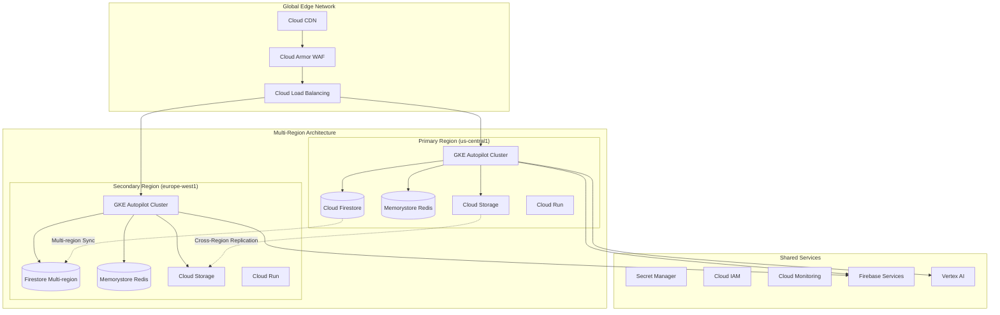

# Google Cloud Platform Architecture & Best Practices
## Enterprise Cloud Infrastructure for Resume Processing Platform

---

## 📋 Table of Contents

1. [GCP Architecture Overview](#gcp-architecture-overview)
2. [Cloud Firestore Architecture](#cloud-firestore-architecture)
3. [Google Kubernetes Engine (GKE)](#google-kubernetes-engine-gke)
4. [Cloud Storage & CDN](#cloud-storage--cdn)
5. [Networking & Security](#networking--security)
6. [Firebase Integration](#firebase-integration)
7. [Infrastructure as Code (Terraform)](#infrastructure-as-code-terraform)
8. [Scaling & Performance](#scaling--performance)
9. [Disaster Recovery & High Availability](#disaster-recovery--high-availability)
10. [Cost Optimization](#cost-optimization)
11. [Monitoring & Observability](#monitoring--observability)
12. [CI/CD with Cloud Build](#cicd-with-cloud-build)

---

## 🏗️ GCP Architecture Overview

### High-Level Architecture



### Core Architecture Principles

```typescript
export const GCPArchitecturePrinciples = {
  // Cloud-Native Design
  cloudNative: {
    containerized: true,
    serverless: ['Cloud Run', 'Cloud Functions'],
    managed: ['GKE Autopilot', 'Cloud Firestore', 'Memorystore'],
    scalability: 'Horizontal auto-scaling'
  },
  
  // Security First
  security: {
    encryption: 'Default encryption at rest',
    identity: 'Cloud IAM with least privilege',
    network: 'Private GKE clusters with Cloud NAT',
    compliance: ['SOC2', 'ISO27001', 'GDPR']
  },
  
  // High Availability
  availability: {
    sla: '99.95%',
    multiRegion: true,
    autoFailover: true,
    backups: 'Automated daily'
  },
  
  // Performance
  performance: {
    caching: ['CDN', 'Memorystore', 'Application cache'],
    optimization: 'Premium network tier',
    proximity: 'Edge locations worldwide'
  }
};
```

---

## 🔥 Cloud Firestore Architecture

### Firestore Configuration

```typescript
// Firestore Architecture for Resume Processing
export const FirestoreArchitecture = {
  // Database Configuration
  database: {
    type: 'Native mode',
    multiRegion: 'nam5', // US multi-region
    consistency: 'Strong consistency',
    encryption: 'Google-managed encryption keys'
  },
  
  // Collection Design
  collections: {
    // User data with subcollections
    users: {
      sharding: 'userId hash prefix',
      subcollections: [
        'resumes',
        'jobContexts',
        'analysisHistory',
        'preferences'
      ],
      indexes: [
        'email',
        'createdAt',
        'subscription.status'
      ]
    },
    
    // Shared team data
    teams: {
      sharding: 'teamId prefix',
      subcollections: [
        'members',
        'sharedResumes',
        'permissions'
      ]
    },
    
    // Global metadata
    metadata: {
      documents: [
        'statistics',
        'keywords',
        'templates'
      ]
    }
  },
  
  // Performance Optimization
  optimization: {
    denormalization: 'Strategic field duplication',
    aggregation: 'Distributed counters',
    caching: 'Firestore offline persistence',
    batching: 'Max 500 operations per batch'
  }
};

// Firestore Data Model
export interface FirestoreDataModel {
  // User document
  users: {
    [userId: string]: {
      profile: UserProfile;
      subscription: SubscriptionData;
      settings: UserSettings;
      metadata: {
        createdAt: Timestamp;
        lastActive: Timestamp;
        resumeCount: number;
      };
      
      // Subcollections
      resumes?: {
        [resumeId: string]: {
          content: string;
          parsedData: ParsedResume;
          metadata: ResumeMetadata;
          versions: Version[];
          sharing: SharingSettings;
        };
      };
      
      jobContexts?: {
        [jobId: string]: {
          title: string;
          company: string;
          description: string;
          keywordAnalysis?: KeywordAnalysis;
          appliedDate?: Timestamp;
        };
      };
    };
  };
  
  // Team collaboration
  teams: {
    [teamId: string]: {
      name: string;
      plan: TeamPlan;
      settings: TeamSettings;
      
      members?: {
        [userId: string]: {
          role: 'owner' | 'admin' | 'member';
          permissions: string[];
          joinedAt: Timestamp;
        };
      };
    };
  };
}

// Firestore Security Rules Implementation
export const firestoreSecurityRules = `
rules_version = '2';
service cloud.firestore {
  match /databases/{database}/documents {
    // Helper functions
    function isSignedIn() {
      return request.auth != null;
    }
    
    function isOwner(userId) {
      return isSignedIn() && request.auth.uid == userId;
    }
    
    function isTeamMember(teamId) {
      return isSignedIn() && 
        exists(/databases/$(database)/documents/teams/$(teamId)/members/$(request.auth.uid));
    }
    
    function hasValidSubscription() {
      return isSignedIn() &&
        get(/databases/$(database)/documents/users/$(request.auth.uid)).data.subscription.status == 'active';
    }
    
    function withinRateLimit() {
      return request.time > resource.data.lastUpdate + duration.value(1, 's');
    }
    
    // Users collection
    match /users/{userId} {
      allow read: if isOwner(userId);
      allow update: if isOwner(userId) && withinRateLimit();
      allow delete: if false; // Soft delete only
      
      // Resume subcollection
      match /resumes/{resumeId} {
        allow read: if isOwner(userId) || 
          (resource.data.sharing.public == true) ||
          (request.auth.uid in resource.data.sharing.sharedWith);
          
        allow create: if isOwner(userId) && 
          request.resource.data.size() < 10 * 1024 * 1024; // 10MB limit
          
        allow update: if isOwner(userId) && withinRateLimit();
        allow delete: if isOwner(userId);
      }
      
      // Job contexts subcollection
      match /jobContexts/{jobId} {
        allow read, write: if isOwner(userId);
      }
    }
    
    // Teams collection
    match /teams/{teamId} {
      allow read: if isTeamMember(teamId);
      allow update: if isTeamMember(teamId) && 
        get(/databases/$(database)/documents/teams/$(teamId)/members/$(request.auth.uid)).data.role in ['owner', 'admin'];
      
      match /members/{memberId} {
        allow read: if isTeamMember(teamId);
        allow write: if isTeamMember(teamId) &&
          get(/databases/$(database)/documents/teams/$(teamId)/members/$(request.auth.uid)).data.role == 'owner';
      }
    }
  }
}`;

// Firestore Performance Optimization
export class FirestoreOptimization {
  // Composite Indexes
  static indexes = [
    {
      collection: 'users',
      fields: [
        { field: 'subscription.status', mode: 'ASCENDING' },
        { field: 'metadata.lastActive', mode: 'DESCENDING' }
      ]
    },
    {
      collection: 'users/{userId}/resumes',
      fields: [
        { field: 'metadata.createdAt', mode: 'DESCENDING' },
        { field: 'metadata.score', mode: 'DESCENDING' }
      ]
    }
  ];
  
  // Distributed Counter Implementation
  async incrementCounter(
    docPath: string,
    field: string,
    increment: number = 1
  ): Promise<void> {
    const shardId = Math.floor(Math.random() * 10);
    const shardRef = doc(
      this.firestore,
      `${docPath}/shards/${shardId}`
    );
    
    await updateDoc(shardRef, {
      [field]: FieldValue.increment(increment)
    });
  }
  
  // Batch Operations
  async batchWrite(operations: BatchOperation[]): Promise<void> {
    const batches: WriteBatch[] = [];
    let currentBatch = writeBatch(this.firestore);
    let operationCount = 0;
    
    for (const operation of operations) {
      switch (operation.type) {
        case 'set':
          currentBatch.set(operation.ref, operation.data);
          break;
        case 'update':
          currentBatch.update(operation.ref, operation.data);
          break;
        case 'delete':
          currentBatch.delete(operation.ref);
          break;
      }
      
      operationCount++;
      
      // Firestore limit: 500 operations per batch
      if (operationCount === 500) {
        batches.push(currentBatch);
        currentBatch = writeBatch(this.firestore);
        operationCount = 0;
      }
    }
    
    if (operationCount > 0) {
      batches.push(currentBatch);
    }
    
    // Execute all batches in parallel
    await Promise.all(batches.map(batch => batch.commit()));
  }
  
  // Query Optimization
  async optimizedQuery<T>(
    query: Query<T>,
    options: QueryOptions = {}
  ): Promise<T[]> {
    // Add caching layer
    const cacheKey = this.generateQueryCacheKey(query);
    const cached = await this.cache.get(cacheKey);
    
    if (cached && !options.bypassCache) {
      return cached;
    }
    
    // Execute query with limit
    let optimizedQuery = query;
    if (options.limit) {
      optimizedQuery = optimizedQuery.limit(options.limit);
    }
    
    // Use cursor for pagination
    if (options.startAfter) {
      optimizedQuery = optimizedQuery.startAfter(options.startAfter);
    }
    
    const snapshot = await optimizedQuery.get();
    const results = snapshot.docs.map(doc => ({
      id: doc.id,
      ...doc.data()
    })) as T[];
    
    // Cache results
    await this.cache.set(cacheKey, results, options.cacheTTL || 300);
    
    return results;
  }
}
```

### Firestore Backup Strategy

```yaml
# firestore-backup.yaml
apiVersion: batch/v1
kind: CronJob
metadata:
  name: firestore-backup
spec:
  schedule: "0 2 * * *" # Daily at 2 AM
  jobTemplate:
    spec:
      template:
        spec:
          serviceAccountName: firestore-backup-sa
          containers:
          - name: backup
            image: gcr.io/google.com/cloudsdktool/cloud-sdk:latest
            command:
            - /bin/bash
            - -c
            - |
              # Export Firestore to Cloud Storage
              DATE=$(date +%Y%m%d-%H%M%S)
              BUCKET="gs://resume-parser-backups/firestore"
              
              gcloud firestore export \
                --collection-ids='users,teams,metadata' \
                --async \
                $BUCKET/$DATE
              
              # Clean up old backups (keep 30 days)
              gsutil -m rm -r $BUCKET/$(date -d '30 days ago' +%Y%m%d)*
          restartPolicy: OnFailure
```

---

## 🚀 Google Kubernetes Engine (GKE)

### GKE Cluster Configuration

```hcl
# terraform/gke.tf
resource "google_container_cluster" "primary" {
  name     = "resume-parser-primary"
  location = "us-central1"
  
  # Autopilot mode for managed Kubernetes
  enable_autopilot = true
  
  # Network configuration
  network    = google_compute_network.vpc.name
  subnetwork = google_compute_subnetwork.subnet.name
  
  # Security settings
  private_cluster_config {
    enable_private_nodes    = true
    enable_private_endpoint = false
    master_ipv4_cidr_block  = "10.0.0.0/28"
  }
  
  # Workload Identity
  workload_identity_config {
    workload_pool = "${var.project_id}.svc.id.goog"
  }
  
  # Release channel for automatic updates
  release_channel {
    channel = "REGULAR"
  }
  
  # Monitoring and logging
  monitoring_config {
    enable_components = ["SYSTEM_COMPONENTS", "WORKLOADS"]
    managed_prometheus {
      enabled = true
    }
  }
  
  logging_config {
    enable_components = ["SYSTEM_COMPONENTS", "WORKLOADS"]
  }
  
  # Maintenance window
  maintenance_policy {
    recurring_window {
      start_time = "2023-01-01T09:00:00Z"
      end_time   = "2023-01-01T17:00:00Z"
      recurrence = "FREQ=WEEKLY;BYDAY=SU"
    }
  }
}

# Node pools for standard GKE (if not using Autopilot)
resource "google_container_node_pool" "primary_nodes" {
  count      = var.enable_autopilot ? 0 : 1
  name       = "primary-node-pool"
  cluster    = google_container_cluster.primary.name
  location   = google_container_cluster.primary.location
  
  # Autoscaling
  autoscaling {
    min_node_count = 3
    max_node_count = 20
  }
  
  # Node configuration
  node_config {
    preemptible  = false
    machine_type = "n2-standard-4"
    
    # Disk configuration
    disk_size_gb = 100
    disk_type    = "pd-ssd"
    
    # Security
    service_account = google_service_account.gke_node.email
    oauth_scopes = [
      "https://www.googleapis.com/auth/cloud-platform"
    ]
    
    # Workload Identity
    workload_metadata_config {
      mode = "GKE_METADATA"
    }
    
    # Labels and taints
    labels = {
      environment = "production"
      team        = "platform"
    }
    
    tags = ["gke-node", "production"]
  }
  
  # Management
  management {
    auto_repair  = true
    auto_upgrade = true
  }
}

# Spot instance node pool for cost optimization
resource "google_container_node_pool" "spot_nodes" {
  count      = var.enable_spot_nodes ? 1 : 0
  name       = "spot-node-pool"
  cluster    = google_container_cluster.primary.name
  location   = google_container_cluster.primary.location
  
  autoscaling {
    min_node_count = 0
    max_node_count = 10
  }
  
  node_config {
    spot         = true
    machine_type = "n2-standard-4"
    
    taint {
      key    = "spot-instance"
      value  = "true"
      effect = "NO_SCHEDULE"
    }
  }
}
```

### Kubernetes Deployments

```yaml
# k8s/deployment.yaml
apiVersion: apps/v1
kind: Deployment
metadata:
  name: resume-parser-api
  namespace: production
  labels:
    app: resume-parser
    component: api
spec:
  replicas: 3
  strategy:
    type: RollingUpdate
    rollingUpdate:
      maxSurge: 1
      maxUnavailable: 0
  selector:
    matchLabels:
      app: resume-parser
      component: api
  template:
    metadata:
      labels:
        app: resume-parser
        component: api
      annotations:
        prometheus.io/scrape: "true"
        prometheus.io/port: "9090"
    spec:
      serviceAccountName: resume-parser-sa
      
      # Security context
      securityContext:
        runAsNonRoot: true
        runAsUser: 1000
        fsGroup: 2000
      
      # Node affinity for spreading
      affinity:
        podAntiAffinity:
          preferredDuringSchedulingIgnoredDuringExecution:
          - weight: 100
            podAffinityTerm:
              labelSelector:
                matchExpressions:
                - key: app
                  operator: In
                  values:
                  - resume-parser
              topologyKey: kubernetes.io/hostname
      
      containers:
      - name: api
        image: gcr.io/resume-parser/api:v2.0.0
        imagePullPolicy: IfNotPresent
        
        # Resource management
        resources:
          requests:
            cpu: 500m
            memory: 1Gi
            ephemeral-storage: 1Gi
          limits:
            cpu: 2000m
            memory: 4Gi
            ephemeral-storage: 2Gi
        
        # Environment variables
        env:
        - name: NODE_ENV
          value: "production"
        - name: GOOGLE_APPLICATION_CREDENTIALS
          value: "/var/secrets/google/key.json"
        - name: FIRESTORE_PROJECT_ID
          valueFrom:
            configMapKeyRef:
              name: app-config
              key: project_id
        - name: REDIS_HOST
          valueFrom:
            secretKeyRef:
              name: redis-config
              key: host
        
        # Health checks
        livenessProbe:
          httpGet:
            path: /health/live
            port: 3000
          initialDelaySeconds: 30
          periodSeconds: 10
          timeoutSeconds: 5
          failureThreshold: 3
        
        readinessProbe:
          httpGet:
            path: /health/ready
            port: 3000
          initialDelaySeconds: 10
          periodSeconds: 5
          timeoutSeconds: 3
          failureThreshold: 3
        
        # Startup probe for slow starts
        startupProbe:
          httpGet:
            path: /health/startup
            port: 3000
          initialDelaySeconds: 0
          periodSeconds: 10
          timeoutSeconds: 5
          failureThreshold: 30
        
        # Volume mounts
        volumeMounts:
        - name: google-service-account
          mountPath: /var/secrets/google
          readOnly: true
        - name: tmp
          mountPath: /tmp
        
        # Security
        securityContext:
          allowPrivilegeEscalation: false
          readOnlyRootFilesystem: true
          runAsNonRoot: true
          capabilities:
            drop:
            - ALL
      
      # Volumes
      volumes:
      - name: google-service-account
        secret:
          secretName: google-service-account
      - name: tmp
        emptyDir: {}

---
# Horizontal Pod Autoscaler
apiVersion: autoscaling/v2
kind: HorizontalPodAutoscaler
metadata:
  name: resume-parser-api-hpa
  namespace: production
spec:
  scaleTargetRef:
    apiVersion: apps/v1
    kind: Deployment
    name: resume-parser-api
  minReplicas: 3
  maxReplicas: 50
  metrics:
  - type: Resource
    resource:
      name: cpu
      target:
        type: Utilization
        averageUtilization: 70
  - type: Resource
    resource:
      name: memory
      target:
        type: Utilization
        averageUtilization: 80
  - type: Pods
    pods:
      metric:
        name: http_requests_per_second
      target:
        type: AverageValue
        averageValue: "1000"
  behavior:
    scaleUp:
      stabilizationWindowSeconds: 60
      policies:
      - type: Percent
        value: 100
        periodSeconds: 60
      - type: Pods
        value: 5
        periodSeconds: 60
      selectPolicy: Max
    scaleDown:
      stabilizationWindowSeconds: 300
      policies:
      - type: Percent
        value: 10
        periodSeconds: 60
```

### Service Mesh (Istio)

```yaml
# istio/virtual-service.yaml
apiVersion: networking.istio.io/v1beta1
kind: VirtualService
metadata:
  name: resume-parser
  namespace: production
spec:
  hosts:
  - api.resumeparser.app
  gateways:
  - resume-parser-gateway
  http:
  - match:
    - uri:
        prefix: /api/v2
    route:
    - destination:
        host: resume-parser-api
        port:
          number: 3000
      weight: 100
    timeout: 30s
    retries:
      attempts: 3
      perTryTimeout: 10s
      retryOn: 5xx,reset,connect-failure,refused-stream
  - match:
    - uri:
        prefix: /api/v1
    route:
    - destination:
        host: resume-parser-api-v1
        port:
          number: 3000
    fault:
      abort:
        percentage:
          value: 0.1
        httpStatus: 503

---
# Circuit Breaker
apiVersion: networking.istio.io/v1beta1
kind: DestinationRule
metadata:
  name: resume-parser-api
  namespace: production
spec:
  host: resume-parser-api
  trafficPolicy:
    connectionPool:
      tcp:
        maxConnections: 100
      http:
        http1MaxPendingRequests: 50
        http2MaxRequests: 100
        maxRequestsPerConnection: 2
    outlierDetection:
      consecutiveErrors: 5
      interval: 30s
      baseEjectionTime: 30s
      maxEjectionPercent: 50
      minHealthPercent: 30
```

---

## 📦 Cloud Storage & CDN

### Cloud Storage Configuration

```hcl
# terraform/storage.tf
# Main storage bucket for resumes
resource "google_storage_bucket" "resumes" {
  name          = "${var.project_id}-resumes"
  location      = "US"
  storage_class = "STANDARD"
  
  # Lifecycle rules
  lifecycle_rule {
    condition {
      age = 30
    }
    action {
      type          = "SetStorageClass"
      storage_class = "NEARLINE"
    }
  }
  
  lifecycle_rule {
    condition {
      age = 365
    }
    action {
      type          = "SetStorageClass"
      storage_class = "ARCHIVE"
    }
  }
  
  # Versioning
  versioning {
    enabled = true
  }
  
  # Encryption
  encryption {
    default_kms_key_name = google_kms_crypto_key.storage.id
  }
  
  # CORS for direct uploads
  cors {
    origin          = ["https://app.resumeparser.app"]
    method          = ["GET", "POST", "PUT", "DELETE"]
    response_header = ["*"]
    max_age_seconds = 3600
  }
  
  # Access logging
  logging {
    log_bucket = google_storage_bucket.logs.name
    log_object_prefix = "storage-logs/"
  }
}

# Temporary upload bucket
resource "google_storage_bucket" "temp_uploads" {
  name          = "${var.project_id}-temp-uploads"
  location      = "US"
  storage_class = "STANDARD"
  
  # Auto-delete after 24 hours
  lifecycle_rule {
    condition {
      age = 1
    }
    action {
      type = "Delete"
    }
  }
  
  # Retention policy
  retention_policy {
    retention_period = 86400 # 24 hours
  }
}

# Static assets bucket for CDN
resource "google_storage_bucket" "static_assets" {
  name          = "${var.project_id}-static-assets"
  location      = "US"
  storage_class = "STANDARD"
  
  # Public access for CDN
  uniform_bucket_level_access = true
  
  # Website configuration
  website {
    main_page_suffix = "index.html"
    not_found_page   = "404.html"
  }
}

# IAM bindings
resource "google_storage_bucket_iam_member" "static_public" {
  bucket = google_storage_bucket.static_assets.name
  role   = "roles/storage.objectViewer"
  member = "allUsers"
}
```

### Cloud CDN Configuration

```hcl
# terraform/cdn.tf
# Backend bucket for static assets
resource "google_compute_backend_bucket" "static_assets" {
  name        = "resume-parser-static-assets"
  bucket_name = google_storage_bucket.static_assets.name
  
  # CDN policy
  cdn_policy {
    cache_mode = "CACHE_ALL_STATIC"
    default_ttl = 3600
    max_ttl     = 86400
    
    negative_caching = true
    negative_caching_policy {
      code = 404
      ttl  = 120
    }
    
    cache_key_policy {
      include_host          = true
      include_protocol      = true
      include_query_string  = false
    }
  }
  
  # Compression
  compression_mode = "AUTOMATIC"
}

# URL map
resource "google_compute_url_map" "cdn" {
  name            = "resume-parser-cdn"
  default_service = google_compute_backend_bucket.static_assets.id
  
  host_rule {
    hosts        = ["cdn.resumeparser.app"]
    path_matcher = "allpaths"
  }
  
  path_matcher {
    name            = "allpaths"
    default_service = google_compute_backend_bucket.static_assets.id
    
    path_rule {
      paths   = ["/api/*"]
      service = google_compute_backend_service.api.id
    }
    
    path_rule {
      paths   = ["/assets/*", "/images/*", "/fonts/*"]
      service = google_compute_backend_bucket.static_assets.id
      
      route_action {
        cdn_policy {
          cache_mode = "FORCE_CACHE_ALL"
          default_ttl = 86400
        }
      }
    }
  }
}

# HTTPS proxy
resource "google_compute_target_https_proxy" "cdn" {
  name             = "resume-parser-https-proxy"
  url_map          = google_compute_url_map.cdn.id
  ssl_certificates = [google_compute_managed_ssl_certificate.cdn.id]
}

# Global forwarding rule
resource "google_compute_global_forwarding_rule" "cdn" {
  name       = "resume-parser-cdn-forwarding"
  target     = google_compute_target_https_proxy.cdn.id
  port_range = "443"
  ip_address = google_compute_global_address.cdn.address
}

# SSL certificate
resource "google_compute_managed_ssl_certificate" "cdn" {
  name = "resume-parser-cdn-cert"
  
  managed {
    domains = ["cdn.resumeparser.app", "app.resumeparser.app"]
  }
}
```

---

## 🔒 Networking & Security

### VPC Configuration

```hcl
# terraform/network.tf
# VPC
resource "google_compute_network" "vpc" {
  name                    = "resume-parser-vpc"
  auto_create_subnetworks = false
  routing_mode            = "REGIONAL"
}

# Subnets
resource "google_compute_subnetwork" "subnet_us_central" {
  name          = "subnet-us-central"
  ip_cidr_range = "10.0.0.0/20"
  region        = "us-central1"
  network       = google_compute_network.vpc.id
  
  # Secondary ranges for GKE
  secondary_ip_range {
    range_name    = "pods"
    ip_cidr_range = "10.4.0.0/14"
  }
  
  secondary_ip_range {
    range_name    = "services"
    ip_cidr_range = "10.8.0.0/20"
  }
  
  # Private Google Access
  private_ip_google_access = true
  
  # Flow logs
  log_config {
    aggregation_interval = "INTERVAL_5_SEC"
    flow_sampling        = 0.5
    metadata             = "INCLUDE_ALL_METADATA"
  }
}

# Cloud NAT for outbound traffic
resource "google_compute_router" "nat_router" {
  name    = "nat-router"
  region  = "us-central1"
  network = google_compute_network.vpc.id
}

resource "google_compute_router_nat" "nat" {
  name                               = "resume-parser-nat"
  router                             = google_compute_router.nat_router.name
  region                             = google_compute_router.nat_router.region
  nat_ip_allocate_option             = "AUTO_ONLY"
  source_subnetwork_ip_ranges_to_nat = "ALL_SUBNETWORKS_ALL_IP_RANGES"
  
  log_config {
    enable = true
    filter = "ERRORS_ONLY"
  }
}

# Firewall rules
resource "google_compute_firewall" "allow_health_checks" {
  name    = "allow-health-checks"
  network = google_compute_network.vpc.name
  
  allow {
    protocol = "tcp"
    ports    = ["80", "443", "3000", "8080"]
  }
  
  source_ranges = [
    "35.191.0.0/16",
    "130.211.0.0/22"
  ]
  
  target_tags = ["gke-node", "health-check"]
}

resource "google_compute_firewall" "deny_all_ingress" {
  name     = "deny-all-ingress"
  network  = google_compute_network.vpc.name
  priority = 65534
  
  deny {
    protocol = "all"
  }
  
  source_ranges = ["0.0.0.0/0"]
}
```

### Cloud Armor (WAF)

```hcl
# terraform/armor.tf
# Security policy
resource "google_compute_security_policy" "waf" {
  name = "resume-parser-waf"
  
  # Default rule
  rule {
    action   = "allow"
    priority = "2147483647"
    match {
      versioned_expr = "SRC_IPS_V1"
      config {
        src_ip_ranges = ["*"]
      }
    }
  }
  
  # Rate limiting
  rule {
    action   = "rate_based_ban"
    priority = "1000"
    match {
      versioned_expr = "SRC_IPS_V1"
      config {
        src_ip_ranges = ["*"]
      }
    }
    rate_limit_options {
      conform_action = "allow"
      exceed_action = "deny(429)"
      enforce_on_key = "IP"
      rate_limit_threshold {
        count        = 100
        interval_sec = 60
      }
      ban_duration_sec = 600
    }
  }
  
  # OWASP Top 10 rules
  rule {
    action   = "deny(403)"
    priority = "1001"
    match {
      expr {
        expression = "evaluatePreconfiguredExpr('xss-stable')"
      }
    }
  }
  
  rule {
    action   = "deny(403)"
    priority = "1002"
    match {
      expr {
        expression = "evaluatePreconfiguredExpr('sqli-stable')"
      }
    }
  }
  
  rule {
    action   = "deny(403)"
    priority = "1003"
    match {
      expr {
        expression = "evaluatePreconfiguredExpr('lfi-stable')"
      }
    }
  }
  
  rule {
    action   = "deny(403)"
    priority = "1004"
    match {
      expr {
        expression = "evaluatePreconfiguredExpr('rce-stable')"
      }
    }
  }
  
  # Geo-blocking (if needed)
  rule {
    action   = "deny(403)"
    priority = "2000"
    match {
      expr {
        expression = "origin.region_code == 'CN' || origin.region_code == 'RU'"
      }
    }
    description = "Block specific countries"
  }
  
  # Custom rules for resume parser
  rule {
    action   = "deny(403)"
    priority = "3000"
    match {
      expr {
        expression = "request.path.matches('/api/.*') && request.method == 'POST' && int(request.headers['content-length']) > 10485760"
      }
    }
    description = "Block large POST requests (>10MB)"
  }
  
  # Adaptive protection
  adaptive_protection_config {
    layer_7_ddos_defense_config {
      enable = true
    }
  }
}

# Apply to backend service
resource "google_compute_backend_service" "api" {
  name                  = "resume-parser-api-backend"
  protocol              = "HTTPS"
  port_name             = "https"
  timeout_sec           = 30
  enable_cdn            = true
  security_policy       = google_compute_security_policy.waf.id
  
  backend {
    group = google_compute_network_endpoint_group.gke_neg.id
  }
  
  health_checks = [google_compute_health_check.api.id]
  
  log_config {
    enable      = true
    sample_rate = 1.0
  }
}
```

### Identity & Access Management

```hcl
# terraform/iam.tf
# Service accounts
resource "google_service_account" "gke_workload" {
  account_id   = "resume-parser-workload"
  display_name = "Resume Parser Workload Identity"
  description  = "Service account for GKE workloads"
}

resource "google_service_account" "cloud_run" {
  account_id   = "resume-parser-cloud-run"
  display_name = "Resume Parser Cloud Run"
  description  = "Service account for Cloud Run services"
}

# Workload Identity binding
resource "google_service_account_iam_member" "workload_identity_binding" {
  service_account_id = google_service_account.gke_workload.name
  role               = "roles/iam.workloadIdentityUser"
  member             = "serviceAccount:${var.project_id}.svc.id.goog[production/resume-parser-sa]"
}

# IAM roles
resource "google_project_iam_custom_role" "resume_parser_role" {
  role_id     = "resumeParserRole"
  title       = "Resume Parser Application Role"
  description = "Custom role for Resume Parser application"
  
  permissions = [
    # Firestore
    "datastore.databases.get",
    "datastore.entities.get",
    "datastore.entities.list",
    "datastore.entities.create",
    "datastore.entities.update",
    "datastore.entities.delete",
    
    # Storage
    "storage.buckets.get",
    "storage.objects.get",
    "storage.objects.list",
    "storage.objects.create",
    "storage.objects.delete",
    
    # Secret Manager
    "secretmanager.versions.access",
    
    # Cloud Logging
    "logging.logEntries.create",
    
    # Cloud Monitoring
    "monitoring.metricDescriptors.create",
    "monitoring.metricDescriptors.list",
    "monitoring.timeSeries.create",
    
    # Vertex AI
    "aiplatform.endpoints.predict"
  ]
}

# Role bindings
resource "google_project_iam_member" "gke_workload_custom" {
  project = var.project_id
  role    = google_project_iam_custom_role.resume_parser_role.id
  member  = "serviceAccount:${google_service_account.gke_workload.email}"
}

# Secret Manager access
resource "google_secret_manager_secret_iam_member" "app_secrets" {
  for_each = toset([
    "firebase-config",
    "redis-password",
    "api-keys"
  ])
  
  secret_id = google_secret_manager_secret.app_secrets[each.key].id
  role      = "roles/secretmanager.secretAccessor"
  member    = "serviceAccount:${google_service_account.gke_workload.email}"
}
```

---

## 🔥 Firebase Integration

### Firebase Configuration

```typescript
// firebase-config.ts
export const FirebaseConfiguration = {
  // Firebase Project Setup
  project: {
    projectId: process.env.FIREBASE_PROJECT_ID,
    region: 'us-central1',
    multiRegion: 'nam5'
  },
  
  // Authentication Configuration
  auth: {
    providers: [
      'email/password',
      'google.com',
      'github.com'
    ],
    mfa: {
      enabled: true,
      providers: ['totp', 'phone']
    },
    passwordPolicy: {
      requireUppercase: true,
      requireLowercase: true,
      requireNumeric: true,
      requireNonAlphanumeric: true,
      minLength: 12
    },
    actionCodeSettings: {
      url: 'https://app.resumeparser.app/auth/action',
      handleCodeInApp: true
    }
  },
  
  // Cloud Functions
  functions: {
    region: 'us-central1',
    timeout: 540, // 9 minutes max
    memory: '2GB',
    minInstances: 1,
    maxInstances: 100,
    vpcConnector: 'projects/resume-parser/locations/us-central1/connectors/vpc-connector'
  },
  
  // Firebase Hosting
  hosting: {
    site: 'resume-parser-app',
    customDomain: 'app.resumeparser.app',
    headers: [
      {
        source: '**',
        headers: [
          { key: 'X-Frame-Options', value: 'SAMEORIGIN' },
          { key: 'X-Content-Type-Options', value: 'nosniff' },
          { key: 'X-XSS-Protection', value: '1; mode=block' },
          { key: 'Referrer-Policy', value: 'strict-origin-when-cross-origin' }
        ]
      }
    ],
    rewrites: [
      {
        source: '/api/**',
        function: 'api'
      },
      {
        source: '**',
        destination: '/index.html'
      }
    ]
  }
};

// Cloud Functions implementation
import * as functions from 'firebase-functions';
import * as admin from 'firebase-admin';

admin.initializeApp();

// Resume processing trigger
export const processResume = functions
  .runWith({
    timeoutSeconds: 540,
    memory: '2GB',
    minInstances: 1
  })
  .storage
  .object()
  .onFinalize(async (object) => {
    const filePath = object.name;
    const contentType = object.contentType;
    
    // Only process resume files
    if (!contentType?.startsWith('application/') || 
        !filePath?.includes('/resumes/')) {
      return;
    }
    
    try {
      // Download file from Storage
      const bucket = admin.storage().bucket(object.bucket);
      const tempFilePath = `/tmp/${path.basename(filePath)}`;
      await bucket.file(filePath).download({ destination: tempFilePath });
      
      // Process resume
      const result = await processResumeFile(tempFilePath);
      
      // Save results to Firestore
      const userId = filePath.split('/')[1];
      const resumeId = path.basename(filePath, path.extname(filePath));
      
      await admin.firestore()
        .collection('users')
        .doc(userId)
        .collection('resumes')
        .doc(resumeId)
        .update({
          parsedData: result.parsed,
          metadata: result.metadata,
          processedAt: admin.firestore.FieldValue.serverTimestamp(),
          status: 'completed'
        });
      
      // Clean up
      await fs.unlink(tempFilePath);
      
    } catch (error) {
      console.error('Resume processing failed:', error);
      
      // Update status
      await admin.firestore()
        .collection('users')
        .doc(userId)
        .collection('resumes')
        .doc(resumeId)
        .update({
          status: 'failed',
          error: error.message,
          failedAt: admin.firestore.FieldValue.serverTimestamp()
        });
    }
  });

// Scheduled functions
export const dailyBackup = functions
  .runWith({
    timeoutSeconds: 540,
    memory: '1GB'
  })
  .pubsub
  .schedule('0 2 * * *')
  .timeZone('America/Chicago')
  .onRun(async (context) => {
    const bucket = 'gs://resume-parser-backups';
    
    await admin.firestore().backup({
      bucket,
      collections: ['users', 'teams', 'metadata']
    });
    
    // Clean old backups
    await cleanOldBackups(bucket, 30);
  });

// Authentication triggers
export const onUserCreate = functions.auth.user().onCreate(async (user) => {
  // Create user document
  await admin.firestore().collection('users').doc(user.uid).set({
    profile: {
      email: user.email,
      displayName: user.displayName,
      photoURL: user.photoURL,
      createdAt: admin.firestore.FieldValue.serverTimestamp()
    },
    subscription: {
      plan: 'free',
      status: 'active',
      startedAt: admin.firestore.FieldValue.serverTimestamp()
    },
    settings: {
      theme: 'light',
      notifications: true,
      privacy: 'private'
    },
    metadata: {
      lastActive: admin.firestore.FieldValue.serverTimestamp(),
      resumeCount: 0
    }
  });
  
  // Send welcome email
  await sendWelcomeEmail(user.email);
});
```

---

## 🏗️ Infrastructure as Code (Terraform)

### Terraform Structure

```hcl
# terraform/main.tf
terraform {
  required_version = ">= 1.0"
  
  required_providers {
    google = {
      source  = "hashicorp/google"
      version = "~> 5.0"
    }
    google-beta = {
      source  = "hashicorp/google-beta"
      version = "~> 5.0"
    }
    kubernetes = {
      source  = "hashicorp/kubernetes"
      version = "~> 2.23"
    }
    helm = {
      source  = "hashicorp/helm"
      version = "~> 2.11"
    }
  }
  
  backend "gcs" {
    bucket = "resume-parser-terraform-state"
    prefix = "production"
  }
}

# Provider configuration
provider "google" {
  project = var.project_id
  region  = var.region
}

provider "google-beta" {
  project = var.project_id
  region  = var.region
}

# Kubernetes provider
data "google_client_config" "default" {}

data "google_container_cluster" "primary" {
  name     = google_container_cluster.primary.name
  location = google_container_cluster.primary.location
}

provider "kubernetes" {
  host                   = "https://${data.google_container_cluster.primary.endpoint}"
  token                  = data.google_client_config.default.access_token
  cluster_ca_certificate = base64decode(data.google_container_cluster.primary.master_auth[0].cluster_ca_certificate)
}

provider "helm" {
  kubernetes {
    host                   = "https://${data.google_container_cluster.primary.endpoint}"
    token                  = data.google_client_config.default.access_token
    cluster_ca_certificate = base64decode(data.google_container_cluster.primary.master_auth[0].cluster_ca_certificate)
  }
}

# Variables
variable "project_id" {
  description = "GCP project ID"
  type        = string
}

variable "region" {
  description = "GCP region"
  type        = string
  default     = "us-central1"
}

variable "environment" {
  description = "Environment name"
  type        = string
  default     = "production"
}

# Modules
module "networking" {
  source = "./modules/networking"
  
  project_id  = var.project_id
  region      = var.region
  environment = var.environment
}

module "gke" {
  source = "./modules/gke"
  
  project_id  = var.project_id
  region      = var.region
  network     = module.networking.network
  subnetwork  = module.networking.subnetwork
  environment = var.environment
}

module "storage" {
  source = "./modules/storage"
  
  project_id  = var.project_id
  environment = var.environment
}

module "security" {
  source = "./modules/security"
  
  project_id  = var.project_id
  environment = var.environment
}

module "monitoring" {
  source = "./modules/monitoring"
  
  project_id  = var.project_id
  environment = var.environment
}

# Outputs
output "gke_cluster_name" {
  value = module.gke.cluster_name
}

output "gke_cluster_endpoint" {
  value     = module.gke.cluster_endpoint
  sensitive = true
}

output "load_balancer_ip" {
  value = module.networking.load_balancer_ip
}

output "cdn_url" {
  value = "https://${var.cdn_domain}"
}
```

### Terragrunt for Multi-Environment

```hcl
# terragrunt.hcl
locals {
  environment = basename(get_terragrunt_dir())
  project_id  = get_env("GCP_PROJECT_ID")
  region      = get_env("GCP_REGION", "us-central1")
}

remote_state {
  backend = "gcs"
  generate = {
    path      = "backend.tf"
    if_exists = "overwrite"
  }
  config = {
    bucket   = "${local.project_id}-terraform-state"
    prefix   = "${local.environment}/terraform.tfstate"
    project  = local.project_id
    location = local.region
  }
}

generate "provider" {
  path      = "provider.tf"
  if_exists = "overwrite"
  contents  = <<EOF
provider "google" {
  project = "${local.project_id}"
  region  = "${local.region}"
}
EOF
}

inputs = {
  project_id  = local.project_id
  region      = local.region
  environment = local.environment
}
```

---

## 📈 Scaling & Performance

### Auto-scaling Configuration

```yaml
# k8s/autoscaling.yaml
# Vertical Pod Autoscaler
apiVersion: autoscaling.k8s.io/v1
kind: VerticalPodAutoscaler
metadata:
  name: resume-parser-vpa
  namespace: production
spec:
  targetRef:
    apiVersion: apps/v1
    kind: Deployment
    name: resume-parser-api
  updatePolicy:
    updateMode: "Auto"
  resourcePolicy:
    containerPolicies:
    - containerName: api
      minAllowed:
        cpu: 250m
        memory: 512Mi
      maxAllowed:
        cpu: 4
        memory: 8Gi
      controlledResources: ["cpu", "memory"]

---
# Cluster Autoscaler configuration
apiVersion: apps/v1
kind: Deployment
metadata:
  name: cluster-autoscaler
  namespace: kube-system
  labels:
    app: cluster-autoscaler
spec:
  replicas: 1
  selector:
    matchLabels:
      app: cluster-autoscaler
  template:
    metadata:
      labels:
        app: cluster-autoscaler
    spec:
      serviceAccountName: cluster-autoscaler
      containers:
      - image: k8s.gcr.io/autoscaling/cluster-autoscaler:v1.27.0
        name: cluster-autoscaler
        resources:
          limits:
            cpu: 100m
            memory: 300Mi
          requests:
            cpu: 100m
            memory: 300Mi
        command:
        - ./cluster-autoscaler
        - --v=4
        - --stderrthreshold=info
        - --cloud-provider=gce
        - --skip-nodes-with-local-storage=false
        - --expander=least-waste
        - --node-group-auto-discovery=mig:name=resume-parser-.*
        - --balance-similar-node-groups
        - --skip-nodes-with-system-pods=false
        env:
        - name: GOOGLE_APPLICATION_CREDENTIALS
          value: /etc/gcp/key.json
        volumeMounts:
        - name: ssl-certs
          mountPath: /etc/ssl/certs/ca-certificates.crt
          readOnly: true
        - name: gcp-key
          mountPath: /etc/gcp
          readOnly: true
      volumes:
      - name: ssl-certs
        hostPath:
          path: "/etc/ssl/certs/ca-certificates.crt"
      - name: gcp-key
        secret:
          secretName: cluster-autoscaler-gcp-key
```

### Performance Optimization

```typescript
// performance-config.ts
export const PerformanceOptimization = {
  // Connection Pooling
  database: {
    firestore: {
      maxIdleConnections: 10,
      maxOpenConnections: 25,
      connectionTimeout: 30000,
      grpcChannelOptions: {
        'grpc.keepalive_time_ms': 30000,
        'grpc.keepalive_timeout_ms': 10000,
        'grpc.keepalive_permit_without_calls': 1,
        'grpc.http2.max_pings_without_data': 0
      }
    },
    
    redis: {
      host: process.env.REDIS_HOST,
      port: 6379,
      maxRetriesPerRequest: 3,
      enableReadyCheck: true,
      keepAlive: 30000,
      connectionPoolSize: 50
    }
  },
  
  // Caching Strategy
  caching: {
    cdn: {
      staticAssets: 31536000, // 1 year
      apiResponses: {
        '/api/metadata/*': 3600,    // 1 hour
        '/api/templates/*': 86400,  // 24 hours
        '/api/user/*': 0            // No cache
      }
    },
    
    application: {
      firestore: {
        enableOfflinePersistence: true,
        cacheSizeBytes: 100 * 1024 * 1024 // 100MB
      },
      
      redis: {
        defaultTTL: 3600,
        keyPatterns: {
          'session:*': 1800,        // 30 minutes
          'resume:*': 3600,         // 1 hour
          'keywords:*': 86400,      // 24 hours
          'user:*': 300            // 5 minutes
        }
      }
    }
  },
  
  // Resource Limits
  resourceLimits: {
    api: {
      maxRequestSize: '10mb',
      maxUploadSize: '50mb',
      requestTimeout: 30000,
      maxConcurrentRequests: 1000
    },
    
    fileProcessing: {
      maxFileSize: 10 * 1024 * 1024, // 10MB
      maxProcessingTime: 300000,      // 5 minutes
      maxConcurrentJobs: 10
    }
  },
  
  // Query Optimization
  queryOptimization: {
    firestore: {
      batchSize: 500,
      maxInClause: 10,
      indexStrategy: 'composite',
      projectionFields: true
    },
    
    pagination: {
      defaultLimit: 20,
      maxLimit: 100,
      cursorBased: true
    }
  }
};

// Load Balancer Health Check
export const healthCheck = {
  path: '/health',
  port: 3000,
  protocol: 'HTTP',
  interval: 10,
  timeout: 5,
  healthyThreshold: 2,
  unhealthyThreshold: 3,
  matcher: {
    httpCode: '200-299'
  }
};
```

---

## 🔄 Disaster Recovery & High Availability

### Backup Strategy

```yaml
# k8s/backup-cronjob.yaml
apiVersion: batch/v1
kind: CronJob
metadata:
  name: firestore-backup
  namespace: production
spec:
  schedule: "0 2 * * *" # Daily at 2 AM
  concurrencyPolicy: Forbid
  successfulJobsHistoryLimit: 3
  failedJobsHistoryLimit: 3
  jobTemplate:
    spec:
      template:
        spec:
          serviceAccountName: backup-sa
          restartPolicy: OnFailure
          containers:
          - name: backup
            image: gcr.io/resume-parser/backup-tool:latest
            env:
            - name: PROJECT_ID
              value: "resume-parser-prod"
            - name: BACKUP_BUCKET
              value: "gs://resume-parser-backups"
            command: ["/bin/bash"]
            args:
            - -c
            - |
              set -e
              
              # Set variables
              DATE=$(date +%Y%m%d-%H%M%S)
              BACKUP_PATH="${BACKUP_BUCKET}/firestore/${DATE}"
              
              # Firestore export
              echo "Starting Firestore backup to ${BACKUP_PATH}"
              gcloud firestore export ${BACKUP_PATH} \
                --collection-ids=users,teams,metadata \
                --project=${PROJECT_ID}
              
              # Verify backup
              if gsutil ls ${BACKUP_PATH}/ | grep -q "export.done"; then
                echo "Backup completed successfully"
              else
                echo "Backup failed"
                exit 1
              fi
              
              # Clean old backups (keep 30 days)
              echo "Cleaning old backups"
              gsutil -m rm -r ${BACKUP_BUCKET}/firestore/$(date -d '30 days ago' +%Y%m%d)-* || true
              
              # Storage backup
              echo "Backing up Cloud Storage"
              gsutil -m rsync -r -d \
                gs://resume-parser-resumes \
                ${BACKUP_BUCKET}/storage/${DATE}/resumes
              
              # Create backup manifest
              cat > /tmp/manifest.json <<EOF
              {
                "timestamp": "${DATE}",
                "firestore": "${BACKUP_PATH}",
                "storage": "${BACKUP_BUCKET}/storage/${DATE}",
                "status": "completed"
              }
              EOF
              
              gsutil cp /tmp/manifest.json ${BACKUP_BUCKET}/manifests/${DATE}.json
              
              echo "All backups completed"

---
# Disaster Recovery Runbook
apiVersion: v1
kind: ConfigMap
metadata:
  name: dr-runbook
  namespace: production
data:
  runbook.md: |
    # Disaster Recovery Runbook
    
    ## Recovery Procedures
    
    ### 1. Firestore Recovery
    ```bash
    # List available backups
    gsutil ls gs://resume-parser-backups/firestore/
    
    # Restore from backup
    gcloud firestore import gs://resume-parser-backups/firestore/[BACKUP_DATE] \
      --collection-ids=users,teams,metadata
    ```
    
    ### 2. GKE Cluster Recovery
    ```bash
    # Create new cluster from backup
    terraform apply -var="restore_from_backup=true"
    
    # Restore persistent volumes
    kubectl apply -f backup/persistent-volumes.yaml
    
    # Deploy applications
    kubectl apply -k overlays/production/
    ```
    
    ### 3. DNS Failover
    ```bash
    # Update DNS to point to DR region
    gcloud dns record-sets transaction start --zone=resumeparser-zone
    gcloud dns record-sets transaction add \
      --name=api.resumeparser.app. \
      --ttl=60 \
      --type=A \
      --zone=resumeparser-zone \
      [DR_LOAD_BALANCER_IP]
    gcloud dns record-sets transaction execute --zone=resumeparser-zone
    ```
```

### High Availability Configuration

```hcl
# terraform/ha.tf
# Multi-region Firestore
resource "google_firestore_database" "multi_region" {
  project     = var.project_id
  name        = "(default)"
  location_id = "nam5" # North America multi-region
  type        = "FIRESTORE_NATIVE"
  
  # Point-in-time recovery
  point_in_time_recovery_enablement = "POINT_IN_TIME_RECOVERY_ENABLED"
  
  # Backup schedule
  backup_schedule {
    retention = "2419200s" # 4 weeks
    
    daily_recurrence {
      time = "02:00"
    }
  }
}

# Multi-region Cloud Storage
resource "google_storage_bucket" "multi_region" {
  name          = "${var.project_id}-resumes-multi"
  location      = "US" # Multi-region
  storage_class = "STANDARD"
  
  # Cross-region replication
  replication {
    role = "PRIMARY"
    
    destination {
      bucket_name   = google_storage_bucket.dr_bucket.name
      storage_class = "NEARLINE"
    }
  }
  
  # Lifecycle for cost optimization
  lifecycle_rule {
    condition {
      age = 90
    }
    action {
      type          = "SetStorageClass"
      storage_class = "NEARLINE"
    }
  }
}

# Global Load Balancer with failover
resource "google_compute_backend_service" "global" {
  name                  = "resume-parser-global"
  protocol              = "HTTPS"
  load_balancing_scheme = "EXTERNAL"
  
  # Primary backend
  backend {
    group           = google_compute_network_endpoint_group.primary.id
    balancing_mode  = "RATE"
    max_rate        = 10000
    capacity_scaler = 1.0
  }
  
  # DR backend
  backend {
    group           = google_compute_network_endpoint_group.dr.id
    balancing_mode  = "RATE"
    max_rate        = 10000
    capacity_scaler = 0.0 # Standby
    failover        = true
  }
  
  # Health checks
  health_checks = [google_compute_health_check.global.id]
  
  # Outlier detection
  outlier_detection {
    consecutive_errors                    = 5
    consecutive_gateway_failure           = 5
    enforcing_consecutive_errors          = 100
    enforcing_consecutive_gateway_failure = 100
    interval {
      seconds = 30
    }
    base_ejection_time {
      seconds = 30
    }
  }
  
  # Connection draining
  connection_draining_timeout_sec = 300
}
```

---

## 💰 Cost Optimization

### Cost Management Strategy

```hcl
# terraform/cost-optimization.tf
# Preemptible/Spot instances for non-critical workloads
resource "google_container_node_pool" "spot_pool" {
  name       = "spot-pool"
  cluster    = google_container_cluster.primary.name
  location   = google_container_cluster.primary.location
  node_count = 0
  
  autoscaling {
    min_node_count = 0
    max_node_count = 20
  }
  
  node_config {
    preemptible  = true
    machine_type = "e2-standard-4"
    
    # Spot instance configuration
    spot = true
    
    labels = {
      workload = "batch"
      pool     = "spot"
    }
    
    taint {
      key    = "workload"
      value  = "batch"
      effect = "NO_SCHEDULE"
    }
  }
}

# Committed use discounts
resource "google_compute_commitment" "cpu_commitment" {
  name        = "cpu-commitment-1year"
  region      = var.region
  
  resources {
    type   = "VCPU"
    amount = "100"
  }
  
  resources {
    type   = "MEMORY"
    amount = "400"
  }
  
  plan = "TWELVE_MONTH"
}

# Budget alerts
resource "google_billing_budget" "monthly_budget" {
  billing_account = var.billing_account
  display_name    = "Monthly Budget - Production"
  
  budget_filter {
    projects = ["projects/${var.project_id}"]
    services = [
      "services/24E6-581D-38E5", # Compute Engine
      "services/95FF-2EF5-5EA1", # Cloud Storage
      "services/CAD3-9C7A-5D6A"  # Cloud Run
    ]
  }
  
  amount {
    specified_amount {
      currency_code = "USD"
      units         = "10000"
    }
  }
  
  threshold_rules {
    threshold_percent = 0.5
  }
  
  threshold_rules {
    threshold_percent = 0.8
  }
  
  threshold_rules {
    threshold_percent = 1.0
  }
  
  all_updates_rule {
    monitoring_notification_channels = [
      google_monitoring_notification_channel.budget_alerts.id
    ]
    disable_default_iam_recipients = false
  }
}

# Resource quotas
resource "google_compute_project_quota" "quota" {
  metric     = "CPUS"
  limit      = "500"
  dimensions = {
    region = var.region
  }
}
```

### Cost Optimization Policies

```yaml
# k8s/resource-quotas.yaml
apiVersion: v1
kind: ResourceQuota
metadata:
  name: compute-quota
  namespace: production
spec:
  hard:
    requests.cpu: "100"
    requests.memory: 200Gi
    persistentvolumeclaims: "10"
    services.loadbalancers: "2"

---
apiVersion: v1
kind: LimitRange
metadata:
  name: limit-range
  namespace: production
spec:
  limits:
  - max:
      cpu: "4"
      memory: 8Gi
    min:
      cpu: 100m
      memory: 128Mi
    default:
      cpu: 500m
      memory: 1Gi
    defaultRequest:
      cpu: 250m
      memory: 512Mi
    type: Container
  - max:
      storage: 100Gi
    type: PersistentVolumeClaim

---
# Pod Disruption Budget for cost-effective scaling
apiVersion: policy/v1
kind: PodDisruptionBudget
metadata:
  name: api-pdb
  namespace: production
spec:
  minAvailable: 2
  selector:
    matchLabels:
      app: resume-parser
      component: api
```

---

## 📊 Monitoring & Observability

### Cloud Monitoring Stack

```hcl
# terraform/monitoring.tf
# Monitoring workspace
resource "google_monitoring_workspace" "primary" {
  project_id = var.project_id
  
  # Link GKE cluster
  cluster {
    cluster_name = google_container_cluster.primary.name
    location     = google_container_cluster.primary.location
  }
}

# Uptime checks
resource "google_monitoring_uptime_check_config" "api_health" {
  display_name = "API Health Check"
  timeout      = "10s"
  period       = "60s"
  
  http_check {
    path         = "/health"
    port         = "443"
    use_ssl      = true
    validate_ssl = true
  }
  
  monitored_resource {
    type = "uptime_url"
    labels = {
      project_id = var.project_id
      host       = "api.resumeparser.app"
    }
  }
  
  content_matchers {
    content = "\"status\":\"healthy\""
    matcher = "CONTAINS_STRING"
  }
}

# Alert policies
resource "google_monitoring_alert_policy" "high_error_rate" {
  display_name = "High Error Rate"
  combiner     = "OR"
  enabled      = true
  
  conditions {
    display_name = "Error rate > 1%"
    
    condition_threshold {
      filter          = "metric.type=\"logging.googleapis.com/user/error_rate\" resource.type=\"k8s_container\""
      duration        = "300s"
      comparison      = "COMPARISON_GT"
      threshold_value = 0.01
      
      aggregations {
        alignment_period   = "60s"
        per_series_aligner = "ALIGN_RATE"
      }
    }
  }
  
  notification_channels = [
    google_monitoring_notification_channel.email.name,
    google_monitoring_notification_channel.slack.name
  ]
  
  documentation {
    content = "Error rate exceeded 1% for 5 minutes. Check logs and recent deployments."
    mime_type = "text/markdown"
  }
}

# Custom metrics
resource "google_monitoring_metric_descriptor" "resume_processing_time" {
  description  = "Time taken to process a resume"
  display_name = "Resume Processing Time"
  type         = "custom.googleapis.com/resume/processing_time"
  
  metric_kind = "GAUGE"
  value_type  = "DOUBLE"
  unit        = "s"
  
  labels {
    key         = "processing_type"
    value_type  = "STRING"
    description = "Type of processing (fast/full)"
  }
}

# Dashboards
resource "google_monitoring_dashboard" "main" {
  dashboard_json = jsonencode({
    displayName = "Resume Parser - Production"
    mosaicLayout = {
      columns = 12
      tiles = [
        {
          width  = 4
          height = 4
          widget = {
            title = "Request Rate"
            xyChart = {
              dataSets = [{
                timeSeriesQuery = {
                  timeSeriesFilter = {
                    filter = "metric.type=\"kubernetes.io/container/request_count\" resource.type=\"k8s_container\""
                  }
                }
              }]
            }
          }
        },
        {
          width  = 4
          height = 4
          xPos   = 4
          widget = {
            title = "Error Rate"
            xyChart = {
              dataSets = [{
                timeSeriesQuery = {
                  timeSeriesFilter = {
                    filter = "metric.type=\"logging.googleapis.com/user/error_count\" resource.type=\"k8s_container\""
                  }
                }
              }]
            }
          }
        },
        {
          width  = 4
          height = 4
          xPos   = 8
          widget = {
            title = "P95 Latency"
            xyChart = {
              dataSets = [{
                timeSeriesQuery = {
                  timeSeriesFilter = {
                    filter = "metric.type=\"kubernetes.io/container/request_latencies\" resource.type=\"k8s_container\""
                  }
                }
              }]
            }
          }
        }
      ]
    }
  })
}

# Log-based metrics
resource "google_logging_metric" "api_errors" {
  name        = "api_errors"
  description = "Count of API errors"
  filter      = "resource.type=\"k8s_container\" severity>=ERROR"
  
  metric_descriptor {
    metric_kind = "DELTA"
    value_type  = "INT64"
    unit        = "1"
    
    labels {
      key         = "error_type"
      value_type  = "STRING"
      description = "Type of error"
    }
  }
  
  label_extractors = {
    "error_type" = "EXTRACT(jsonPayload.error.type)"
  }
}

# Notification channels
resource "google_monitoring_notification_channel" "email" {
  display_name = "Email Alerts"
  type         = "email"
  
  labels = {
    email_address = "alerts@resumeparser.app"
  }
}

resource "google_monitoring_notification_channel" "slack" {
  display_name = "Slack Alerts"
  type         = "slack"
  
  labels = {
    channel_name = "#alerts"
    url          = var.slack_webhook_url
  }
  
  sensitive_labels {
    auth_token = var.slack_auth_token
  }
}
```

### Application Instrumentation

```typescript
// monitoring.ts
import { MeterProvider } from '@opentelemetry/sdk-metrics';
import { PrometheusExporter } from '@opentelemetry/exporter-prometheus';
import { TraceExporter } from '@google-cloud/opentelemetry-cloud-trace-exporter';

// Metrics setup
const prometheusExporter = new PrometheusExporter({
  port: 9090,
  endpoint: '/metrics',
}, () => {
  console.log('Prometheus metrics server started on port 9090');
});

const meterProvider = new MeterProvider({
  exporter: prometheusExporter,
  interval: 5000,
});

// Create meters
const meter = meterProvider.getMeter('resume-parser');

// Custom metrics
export const metrics = {
  // Counters
  resumeProcessed: meter.createCounter('resume_processed_total', {
    description: 'Total number of resumes processed',
  }),
  
  apiRequests: meter.createCounter('api_requests_total', {
    description: 'Total number of API requests',
  }),
  
  errors: meter.createCounter('errors_total', {
    description: 'Total number of errors',
  }),
  
  // Histograms
  processingDuration: meter.createHistogram('processing_duration_seconds', {
    description: 'Resume processing duration',
    boundaries: [0.1, 0.5, 1, 2, 5, 10, 30, 60],
  }),
  
  apiLatency: meter.createHistogram('api_latency_milliseconds', {
    description: 'API request latency',
    boundaries: [10, 50, 100, 200, 500, 1000, 2000, 5000],
  }),
  
  // Gauges
  activeConnections: meter.createObservableGauge('active_connections', {
    description: 'Number of active connections',
  }),
  
  queueSize: meter.createObservableGauge('queue_size', {
    description: 'Size of processing queue',
  }),
};

// Distributed tracing
import { NodeTracerProvider } from '@opentelemetry/sdk-trace-node';
import { Resource } from '@opentelemetry/resources';
import { SemanticResourceAttributes } from '@opentelemetry/semantic-conventions';

const provider = new NodeTracerProvider({
  resource: new Resource({
    [SemanticResourceAttributes.SERVICE_NAME]: 'resume-parser',
    [SemanticResourceAttributes.SERVICE_VERSION]: process.env.VERSION || '1.0.0',
  }),
});

provider.addSpanProcessor(
  new BatchSpanProcessor(
    new TraceExporter({
      projectId: process.env.GCP_PROJECT_ID,
    })
  )
);

provider.register();

// Logging configuration
import { Logging } from '@google-cloud/logging';

const logging = new Logging({
  projectId: process.env.GCP_PROJECT_ID,
});

const log = logging.log('resume-parser');

export const logger = {
  info: (message: string, metadata?: any) => {
    const entry = log.entry({
      severity: 'INFO',
      resource: {
        type: 'k8s_container',
        labels: {
          project_id: process.env.GCP_PROJECT_ID,
          location: process.env.GCP_REGION,
          cluster_name: process.env.CLUSTER_NAME,
          namespace_name: process.env.NAMESPACE,
          pod_name: process.env.HOSTNAME,
        },
      },
    }, {
      message,
      ...metadata,
    });
    
    log.write(entry);
  },
  
  error: (message: string, error?: Error, metadata?: any) => {
    const entry = log.entry({
      severity: 'ERROR',
      resource: {
        type: 'k8s_container',
        labels: {
          project_id: process.env.GCP_PROJECT_ID,
          location: process.env.GCP_REGION,
          cluster_name: process.env.CLUSTER_NAME,
          namespace_name: process.env.NAMESPACE,
          pod_name: process.env.HOSTNAME,
        },
      },
    }, {
      message,
      error: error?.stack,
      ...metadata,
    });
    
    log.write(entry);
    
    // Increment error counter
    metrics.errors.add(1, {
      error_type: error?.name || 'unknown',
    });
  },
};

// Health check endpoint with detailed status
export const healthCheck = async (req: Request, res: Response) => {
  const checks = {
    firestore: 'unknown',
    redis: 'unknown',
    storage: 'unknown',
  };
  
  try {
    // Check Firestore
    await firestore.collection('health').doc('check').get();
    checks.firestore = 'healthy';
  } catch (error) {
    checks.firestore = 'unhealthy';
  }
  
  try {
    // Check Redis
    await redis.ping();
    checks.redis = 'healthy';
  } catch (error) {
    checks.redis = 'unhealthy';
  }
  
  try {
    // Check Cloud Storage
    await storage.bucket(process.env.STORAGE_BUCKET).getMetadata();
    checks.storage = 'healthy';
  } catch (error) {
    checks.storage = 'unhealthy';
  }
  
  const allHealthy = Object.values(checks).every(status => status === 'healthy');
  
  res.status(allHealthy ? 200 : 503).json({
    status: allHealthy ? 'healthy' : 'unhealthy',
    timestamp: new Date().toISOString(),
    version: process.env.VERSION || '1.0.0',
    checks,
  });
};
```

---

## 🚀 CI/CD with Cloud Build

### Cloud Build Pipeline

```yaml
# cloudbuild.yaml
steps:
  # Build Docker image
  - name: 'gcr.io/cloud-builders/docker'
    args: ['build', '-t', 'gcr.io/$PROJECT_ID/resume-parser:$SHORT_SHA', '.']
    id: 'build-image'

  # Run tests
  - name: 'gcr.io/$PROJECT_ID/resume-parser:$SHORT_SHA'
    args: ['npm', 'test']
    env:
      - 'NODE_ENV=test'
    id: 'run-tests'

  # Security scanning
  - name: 'gcr.io/cloud-builders/gcloud'
    args: ['container', 'images', 'scan', 'gcr.io/$PROJECT_ID/resume-parser:$SHORT_SHA']
    id: 'security-scan'

  # Push to Container Registry
  - name: 'gcr.io/cloud-builders/docker'
    args: ['push', 'gcr.io/$PROJECT_ID/resume-parser:$SHORT_SHA']
    id: 'push-image'

  # Deploy to GKE (staging)
  - name: 'gcr.io/google.com/cloudsdktool/cloud-sdk'
    entrypoint: 'bash'
    args:
      - '-c'
      - |
        gcloud container clusters get-credentials resume-parser-staging \
          --region=us-central1 \
          --project=$PROJECT_ID
        
        kubectl set image deployment/resume-parser-api \
          api=gcr.io/$PROJECT_ID/resume-parser:$SHORT_SHA \
          -n staging
        
        kubectl rollout status deployment/resume-parser-api -n staging
    id: 'deploy-staging'

  # Run integration tests
  - name: 'gcr.io/$PROJECT_ID/integration-tests:latest'
    env:
      - 'API_URL=https://staging.resumeparser.app'
      - 'TEST_SUITE=integration'
    id: 'integration-tests'

  # Deploy to production (manual approval required)
  - name: 'gcr.io/google.com/cloudsdktool/cloud-sdk'
    entrypoint: 'bash'
    args:
      - '-c'
      - |
        if [[ "$BRANCH_NAME" == "main" ]]; then
          gcloud container clusters get-credentials resume-parser-primary \
            --region=us-central1 \
            --project=$PROJECT_ID
          
          kubectl set image deployment/resume-parser-api \
            api=gcr.io/$PROJECT_ID/resume-parser:$SHORT_SHA \
            -n production \
            --record
          
          kubectl rollout status deployment/resume-parser-api -n production
        fi
    id: 'deploy-production'

# Build triggers
options:
  machineType: 'E2_HIGHCPU_8'
  substitutionOption: 'ALLOW_LOOSE'

substitutions:
  _GKE_CLUSTER: 'resume-parser-primary'
  _GKE_REGION: 'us-central1'

# Artifacts
artifacts:
  images:
    - 'gcr.io/$PROJECT_ID/resume-parser:$SHORT_SHA'
    - 'gcr.io/$PROJECT_ID/resume-parser:latest'

# Notifications
availableSecrets:
  secretManager:
    - versionName: projects/$PROJECT_ID/secrets/slack-webhook/versions/latest
      env: 'SLACK_WEBHOOK'
```

### GitOps with Cloud Deploy

```yaml
# clouddeploy.yaml
apiVersion: deploy.cloud.google.com/v1
kind: DeliveryPipeline
metadata:
  name: resume-parser-pipeline
spec:
  description: Resume Parser deployment pipeline
  serialPipeline:
    stages:
    - targetId: staging
      profiles: [staging]
      strategy:
        standard:
          verify: true
    - targetId: production
      profiles: [production]
      strategy:
        canary:
          runtimeConfig:
            kubernetes:
              serviceNetworking:
                service: resume-parser-api
                deployment: resume-parser-api
          canaryDeployment:
            percentages: [25, 50, 100]
            verify: true

---
apiVersion: deploy.cloud.google.com/v1
kind: Target
metadata:
  name: staging
spec:
  description: Staging environment
  gke:
    cluster: projects/resume-parser/locations/us-central1/clusters/resume-parser-staging
  requireApproval: false

---
apiVersion: deploy.cloud.google.com/v1
kind: Target
metadata:
  name: production
spec:
  description: Production environment
  gke:
    cluster: projects/resume-parser/locations/us-central1/clusters/resume-parser-primary
  requireApproval: true
  executionConfigs:
  - usages: [RENDER, DEPLOY]
    defaultPool:
      serviceAccount: cloud-deploy-sa@resume-parser.iam.gserviceaccount.com
```

---

## 🎯 Best Practices Summary

### GCP-Specific Best Practices

1. **Use Managed Services**
   - GKE Autopilot for Kubernetes
   - Cloud Firestore for NoSQL
   - Cloud Run for serverless workloads
   - Vertex AI for ML models

2. **Security First**
   - Enable VPC Service Controls
   - Use Workload Identity for GKE
   - Implement Cloud Armor WAF rules
   - Enable Cloud Security Command Center

3. **Cost Optimization**
   - Use committed use discounts
   - Implement lifecycle policies
   - Use spot/preemptible instances
   - Set up budget alerts

4. **Performance**
   - Use Premium Network Tier
   - Enable Cloud CDN
   - Implement caching at all layers
   - Use regional resources where possible

5. **Reliability**
   - Multi-region Firestore
   - Cross-region replication
   - Automated backups
   - Implement SLOs and error budgets

6. **Monitoring**
   - Use Cloud Monitoring
   - Implement distributed tracing
   - Set up custom metrics
   - Create actionable alerts

### Architecture Decisions

```typescript
export const ArchitectureDecisions = {
  // Why GCP?
  gcp: {
    strengths: [
      'Native Firestore integration',
      'Excellent Firebase ecosystem',
      'Strong AI/ML capabilities',
      'Global network infrastructure'
    ],
    services: {
      compute: 'GKE Autopilot',
      database: 'Cloud Firestore',
      storage: 'Cloud Storage',
      cdn: 'Cloud CDN',
      serverless: 'Cloud Run',
      ai: 'Vertex AI'
    }
  },
  
  // Design patterns
  patterns: {
    microservices: false, // Start with modular monolith
    eventDriven: true,    // Use Pub/Sub for async
    serverless: 'hybrid', // Mix of containers and functions
    multiRegion: true     // For availability
  },
  
  // Technology choices
  stack: {
    language: 'TypeScript',
    runtime: 'Node.js',
    framework: 'Express/Fastify',
    database: 'Firestore',
    cache: 'Redis (Memorystore)',
    queue: 'Cloud Pub/Sub',
    monitoring: 'Cloud Operations'
  }
};
```

---

## 🚀 Conclusion

This comprehensive GCP architecture provides:

1. **Scalability**: Auto-scaling from 0 to millions of users
2. **Reliability**: 99.95% uptime SLA with multi-region failover
3. **Security**: Defense-in-depth with Cloud Armor, IAM, and encryption
4. **Performance**: Global CDN, caching, and optimized data access
5. **Cost-Effectiveness**: Managed services and optimization strategies
6. **Observability**: Complete monitoring and logging stack

The architecture leverages GCP's strengths in managed services, global infrastructure, and tight integration with Firebase/Firestore to deliver a robust, scalable platform for resume processing.

---

**Version**: 1.0.0  
**Last Updated**: January 2025  
**Platform**: Google Cloud Platform  
**Primary Services**: GKE, Cloud Firestore, Cloud Storage, Cloud CDN
